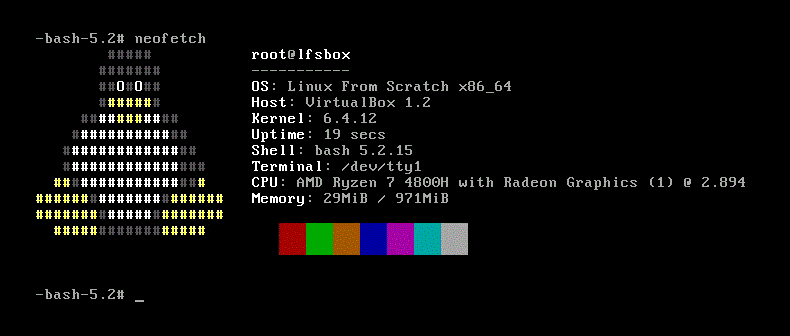

# Linux From Scratch - v12.0
This repository contains my development log while following the [Linux From Scratch](https://www.linuxfromscratch.org/lfs/view/stable/index.html) guide.

`LFS ID: 30340`
## BOOT


## Neofetch :)


## Preparing the build VM  
I used Xubuntu-22 as the base OS to build `LFS` on a separate VDI disk on virtual box

### VM Specifications
- Virtualization Platform: VirtualBox
- Base System OS: xubuntu-22.04.2-desktop-amd64
- Base memory: 3072 MB
- Processors: 1 CPU
- Hard Disks Attached
  - `xubuntu_1.vdi` - 30GB VDI
  - `linuxfromscratch.vdi` - 30GB VDI

## II. Preparing for the Build 

### Chapter 2. Preparing the Host System 

#### 2.2 Host System Requirements 
- install the required packages
```shell
sudo apt install bison gawk m4 texinfo 
sudo ln -sf bash /usr/bin/sh # set the sh shell to bash
```
- run the version check script
```shell
d3bug@vbox:~/LinuxFromScratch$ ./version-check.sh 

OK:    Coreutils 8.32   >= 7.0
OK:    Bash      5.1.16 >= 3.2
OK:    Binutils  2.38   >= 2.13.1
OK:    Bison     3.8.2  >= 2.7
OK:    Diffutils 3.8    >= 2.8.1
OK:    Findutils 4.8.0  >= 4.2.31
OK:    Gawk      5.1.0  >= 4.0.1
OK:    GCC       11.3.0 >= 5.1
OK:    GCC (C++) 11.3.0 >= 5.1
OK:    Grep      3.7    >= 2.5.1a
OK:    Gzip      1.10   >= 1.3.12
OK:    M4        1.4.18 >= 1.4.10
OK:    Make      4.3    >= 4.0
OK:    Patch     2.7.6  >= 2.5.4
OK:    Perl      5.34.0 >= 5.8.8
OK:    Python    3.10.6 >= 3.4
OK:    Sed       4.8    >= 4.1.5
OK:    Tar       1.34   >= 1.22
OK:    Texinfo   6.8    >= 5.0
OK:    Xz        5.2.5  >= 5.0.0
OK:    Linux Kernel 5.19.0 >= 4.14
OK:    Linux Kernel supports UNIX 98 PTY
Aliases:
OK:    awk  is GNU
OK:    yacc is Bison
OK:    sh   is Bash
Compiler check:
OK:    g++ works

```

#### 2.4. Creating a New Partition 
- list the partition 
```shell
d3bug@vbox:~/LinuxFromScratch$ sudo fdisk -l /dev/sdb

Disk /dev/sdb: 30 GiB, 32212254720 bytes, 62914560 sectors
Disk model: VBOX HARDDISK   
Units: sectors of 1 * 512 = 512 bytes
Sector size (logical/physical): 512 bytes / 512 bytes
I/O size (minimum/optimal): 512 bytes / 512 bytes

```
- create a GPT partition 
```shell
d3bug@vbox:~/LinuxFromScratch$ sudo fdisk /dev/sdb

Welcome to fdisk (util-linux 2.37.2).
Changes will remain in memory only, until you decide to write them.
Be careful before using the write command.

Device does not contain a recognized partition table.
Created a new DOS disklabel with disk identifier 0x58f5ed83.

Command (m for help): g
Created a new GPT disklabel (GUID: 59295BBC-3F1A-5D42-8CE4-1123B5E3D435).

Command (m for help): n
Partition number (1-128, default 1): 
First sector (2048-62914526, default 2048): 
Last sector, +/-sectors or +/-size{K,M,G,T,P} (2048-62914526, default 62914526): 

Created a new partition 1 of type 'Linux filesystem' and of size 30 GiB.

Command (m for help): p

Disk /dev/sdb: 30 GiB, 32212254720 bytes, 62914560 sectors
Disk model: VBOX HARDDISK   
Units: sectors of 1 * 512 = 512 bytes
Sector size (logical/physical): 512 bytes / 512 bytes
I/O size (minimum/optimal): 512 bytes / 512 bytes
Disklabel type: gpt
Disk identifier: 59295BBC-3F1A-5D42-8CE4-1123B5E3D435

Device     Start      End  Sectors Size Type
/dev/sdb1   2048 62914526 62912479  30G Linux filesystem

Command (m for help): w
The partition table has been altered.
Calling ioctl() to re-read partition table.
Syncing disks.
```

#### 2.5. Creating a File System on the Partition 
- format the partition to `ext4`
```shell
d3bug@vbox:~/LinuxFromScratch$ sudo mkfs -v -t ext4 /dev/sdb1
mke2fs 1.46.5 (30-Dec-2021)
fs_types for mke2fs.conf resolution: 'ext4'
Filesystem label=
OS type: Linux
Block size=4096 (log=2)
Fragment size=4096 (log=2)
Stride=0 blocks, Stripe width=0 blocks
1966080 inodes, 7864059 blocks
393202 blocks (5.00%) reserved for the super user
First data block=0
Maximum filesystem blocks=2155872256
240 block groups
32768 blocks per group, 32768 fragments per group
8192 inodes per group
Filesystem UUID: 52099d7c-4b1a-46dc-8340-344583a09fc7
Superblock backups stored on blocks: 
	32768, 98304, 163840, 229376, 294912, 819200, 884736, 1605632, 2654208, 
	4096000

Allocating group tables: done                            
Writing inode tables: done                            
Creating journal (32768 blocks): done
Writing superblocks and filesystem accounting information:   0done   

```

#### 2.6. Setting The $LFS Variable 
```shell
d3bug@vbox:~/LinuxFromScratch$ export LFS=/mnt/lfs
d3bug@vbox:~/LinuxFromScratch$ sudo -E env | grep lfs
LFS=/mnt/lfs

```

#### 2.7. Mounting the New Partition 

```shell 
d3bug@vbox:~/LinuxFromScratch$ sudo -E mkdir -pv $LFS
mkdir: created directory '/mnt/lfs'

d3bug@vbox:~/LinuxFromScratch$ sudo -E mount -v -t ext4 /dev/sdb1 $LFS
mount: /dev/sdb1 mounted on /mnt/lfs.

root@vbox:/home/d3bug/LinuxFromScratch# mount | grep -i lfs
/dev/sdb1 on /mnt/lfs type ext4 (rw,relatime)

```


### Chapter 3. Packages and Patches 
- create a dir for packages
```shell
root@vbox:/home/d3bug/LinuxFromScratch# mkdir -v $LFS/sources
mkdir: created directory '/mnt/lfs/sources'

root@vbox:/mnt/lfs# chmod -v a+wt $LFS/sources
mode of '/mnt/lfs/sources' changed from 0755 (rwxr-xr-x) to 1777 (rwxrwxrwt)

```
- download the packages
```shell 
root@vbox:/mnt/lfs# wget https://www.linuxfromscratch.org/lfs/view/stable/wget-list-sysv

root@vbox:/mnt/lfs# wget --input-file=wget-list-sysv --continue --directory-prefix=$LFS/sources

```

download size - 500Mb


### Chapter 4. Final Preparations 

####  4.2. Creating a Limited Directory Layout in the LFS Filesystem 

```shell
root@vbox:/mnt/lfs# mkdir -pv $LFS/{etc,var} $LFS/usr/{bin,lib,sbin}

for i in bin lib sbin; do
  ln -sv usr/$i $LFS/$i
done

case $(uname -m) in
  x86_64) mkdir -pv $LFS/lib64 ;;
esac

mkdir: created directory '/mnt/lfs/etc'
mkdir: created directory '/mnt/lfs/var'
mkdir: created directory '/mnt/lfs/usr'
mkdir: created directory '/mnt/lfs/usr/bin'
mkdir: created directory '/mnt/lfs/usr/lib'
mkdir: created directory '/mnt/lfs/usr/sbin'
'/mnt/lfs/bin' -> 'usr/bin'
'/mnt/lfs/lib' -> 'usr/lib'
'/mnt/lfs/sbin' -> 'usr/sbin'
mkdir: created directory '/mnt/lfs/lib64

root@vbox:/mnt/lfs# mkdir -pv $LFS/tools
mkdir: created directory '/mnt/lfs/tools'
```
####  4.3. Adding the LFS User 
```shell
root@vbox:/mnt/lfs# groupadd lfs
useradd -s /bin/bash -g lfs -m -k /dev/null lfs

root@vbox:/mnt/lfs# chown -v lfs $LFS/{usr{,/*},lib,var,etc,bin,sbin,tools}
case $(uname -m) in
  x86_64) chown -v lfs $LFS/lib64 ;;
esac
changed ownership of '/mnt/lfs/usr' from root to lfs
changed ownership of '/mnt/lfs/usr/bin' from root to lfs
changed ownership of '/mnt/lfs/usr/lib' from root to lfs
changed ownership of '/mnt/lfs/usr/sbin' from root to lfs
ownership of '/mnt/lfs/lib' retained as lfs
changed ownership of '/mnt/lfs/var' from root to lfs
changed ownership of '/mnt/lfs/etc' from root to lfs
ownership of '/mnt/lfs/bin' retained as lfs
ownership of '/mnt/lfs/sbin' retained as lfs
changed ownership of '/mnt/lfs/tools' from root to lfs
changed ownership of '/mnt/lfs/lib64' from root to lfs

```
####  4.4. Setting Up the Environment 
```shell
lfs@vbox:~$ cat > ~/.bashrc << "EOF"
set +h
umask 022
LFS=/mnt/lfs
LC_ALL=POSIX
LFS_TGT=$(uname -m)-lfs-linux-gnu
PATH=/usr/bin
if [ ! -L /bin ]; then PATH=/bin:$PATH; fi
PATH=$LFS/tools/bin:$PATH
CONFIG_SITE=$LFS/usr/share/config.site
export LFS LC_ALL LFS_TGT PATH CONFIG_SITE
EOF

root@vbox:/mnt/lfs# [ ! -e /etc/bash.bashrc ] || mv -v /etc/bash.bashrc /etc/bash.bashrc.NOUSE
renamed '/etc/bash.bashrc' -> '/etc/bash.bashrc.NOUSE'


```

##  III. Building the LFS Cross Toolchain and Temporary Tools 

###  Chapter 5. Compiling a Cross-Toolchain 
####  5.2. Binutils-2.41 - Pass 1 
```shell

lfs:/mnt/lfs/sources$ tar xf binutils-2.41.tar.xz
lfs:/mnt/lfs/sources$ cd binutils-2.41
lfs:/mnt/lfs/sources/binutils-2.41$  mkdir -v build  && cd  build
mkdir: created directory 'build'

lfs:/mnt/lfs/sources/binutils-2.41/build$ ../configure --prefix=$LFS/tools \
                                        --with-sysroot=$LFS \
                                        --target=$LFS_TGT   \
                                        --disable-nls       \
                                        --enable-gprofng=no \
                                        --disable-werror
lfs:/mnt/lfs/sources/binutils-2.41/build$ make && make install
lfs:/mnt/lfs/sources$ rm -rf binutils-2.41

```

#### 5.3. GCC-13.2.0 - Pass 1 
```shell
lfs:/mnt/lfs/sources/gcc-13.2.0$ tar xf gcc-13.2.0.tar.xz && cd gcc-13.2.0

lfs:/mnt/lfs/sources/gcc-13.2.0$ tar -xf ../mpfr-4.2.0.tar.xz
mv -v mpfr-4.2.0 mpfr
tar -xf ../gmp-6.3.0.tar.xz
mv -v gmp-6.3.0 gmp
tar -xf ../mpc-1.3.1.tar.gz
mv -v mpc-1.3.1 mpc
renamed 'mpfr-4.2.0' -> 'mpfr'
renamed 'gmp-6.3.0' -> 'gmp/gmp-6.3.0'
renamed 'mpc-1.3.1' -> 'mpc'

lfs:/mnt/lfs/sources/gcc-13.2.0$ case $(uname -m) in
  x86_64)
    sed -e '/m64=/s/lib64/lib/' \
        -i.orig gcc/config/i386/t-linux64
 ;;
esac
lfs:/mnt/lfs/sources/gcc-13.2.0$ mkdir -v build && cd build

lfs:/mnt/lfs/sources/gcc-13.2.0/build$ ../configure                  \
                                    --target=$LFS_TGT         \
                                    --prefix=$LFS/tools       \
                                    --with-glibc-version=2.38 \
                                    --with-sysroot=$LFS       \
                                    --with-newlib             \
                                    --without-headers         \
                                    --enable-default-pie      \
                                    --enable-default-ssp      \
                                    --disable-nls             \
                                    --disable-shared          \
                                    --disable-multilib        \
                                    --disable-threads         \
                                    --disable-libatomic       \
                                    --disable-libgomp         \
                                    --disable-libquadmath     \
                                    --disable-libssp          \
                                    --disable-libvtv          \
                                    --disable-libstdcxx       \
                                    --enable-languages=c,c++

lfs:/mnt/lfs/sources/gcc-13.2.0/build$ make && make install
lfs:/mnt/lfs/sources/gcc-13.2.0/build$ cd .. \
&& cat gcc/limitx.h gcc/glimits.h gcc/limity.h > \
`dirname $($LFS_TGT-gcc -print-libgcc-file-name)`/include/limits.h

```

####  5.4. Linux-6.4.12 API Headers 
```shell
lfs:/mnt/lfs/sources$ tar xf linux-6.4.12.tar.xz && cd linux-6.4.12
lfs:/mnt/lfs/sources/linux-6.4.12$ make mrproper
lfs:/mnt/lfs/sources/linux-6.4.12$ make headers \
                                    && find usr/include -type f ! -name '*.h' -delete \
                                    && cp -rv usr/include $LFS/usr \


```

####  5.5. Glibc-2.38 
```shell
lfs:/mnt/lfs/sources$ tar xf glibc-2.38.tar.xz && cd glibc-2.38
lfs:/mnt/lfs/sources/glibc-2.38$ case $(uname -m) in
    i?86)   ln -sfv ld-linux.so.2 $LFS/lib/ld-lsb.so.3
    ;;
    x86_64) ln -sfv ../lib/ld-linux-x86-64.so.2 $LFS/lib64
            ln -sfv ../lib/ld-linux-x86-64.so.2 $LFS/lib64/ld-lsb-x86-64.so.3
    ;;
esac

'/mnt/lfs/lib64/ld-linux-x86-64.so.2' -> '../lib/ld-linux-x86-64.so.2'
'/mnt/lfs/lib64/ld-lsb-x86-64.so.3' -> '../lib/ld-linux-x86-64.so.2'

lfs:/mnt/lfs/sources/glibc-2.38$ patch -Np1 -i ../glibc-2.38-fhs-1.patch
patching file Makeconfig
Hunk #1 succeeded at 262 (offset 12 lines).
patching file nscd/nscd.h
Hunk #1 succeeded at 160 (offset 48 lines).
patching file nss/db-Makefile
Hunk #1 succeeded at 21 (offset -1 lines).
patching file sysdeps/generic/paths.h
patching file sysdeps/unix/sysv/linux/paths.h

lfs:/mnt/lfs/sources/glibc-2.38$ mkdir -v build && cd  build
mkdir: created directory 'build'

lfs:/mnt/lfs/sources/glibc-2.38/build$ echo "rootsbindir=/usr/sbin" > configparms

lfs:/mnt/lfs/sources/glibc-2.38/build$ ../configure                             \
      --prefix=/usr                      \
      --host=$LFS_TGT                    \
      --build=$(../scripts/config.guess) \
      --enable-kernel=4.14               \
      --with-headers=$LFS/usr/include    \
      libc_cv_slibdir=/usr/lib
lfs:/mnt/lfs/sources/glibc-2.38/build$ make
lfs:/mnt/lfs/sources/glibc-2.38/build$ make DESTDIR=$LFS install
lfs:/mnt/lfs/sources/glibc-2.38/build$ sed '/RTLDLIST=/s@/usr@@g' -i $LFS/usr/bin/ldd


```
#### 5.6. Libstdc++ from GCC-13.2.0 
```shell
lfs:/mnt/lfs/sources$ tar xf gcc-13.2.0.tar.xz 
lfs:/mnt/lfs/sources$ cd gcc-13.2.0
lfs:/mnt/lfs/sources/gcc-13.2.0$ mkdir -v build
cd       build
mkdir: created directory 'build'
lfs:/mnt/lfs/sources/gcc-13.2.0/build$ ../libstdc++-v3/configure           \
    --host=$LFS_TGT                 \
    --build=$(../config.guess)      \
    --prefix=/usr                   \
    --disable-multilib              \
    --disable-nls                   \
    --disable-libstdcxx-pch         \
    --with-gxx-include-dir=/tools/$LFS_TGT/include/c++/13.2.0
lfs:/mnt/lfs/sources/gcc-13.2.0/build$ make 
lfs:/mnt/lfs/sources/gcc-13.2.0/build$ make DESTDIR=$LFS install
#  Remove the libtool archive files because they are harmful for cross-compilation
lfs:/mnt/lfs/sources/gcc-13.2.0/build$ rm -v $LFS/usr/lib/lib{stdc++,stdc++fs,supc++}.la
removed '/mnt/lfs/usr/lib/libstdc++.la'
removed '/mnt/lfs/usr/lib/libstdc++fs.la'
removed '/mnt/lfs/usr/lib/libsupc++.la'
lfs:/mnt/lfs/sources/gcc-13.2.0/build$ cd ../../
lfs:/mnt/lfs/sources$ rm -rf gcc-13.2.0
```

###  Chapter 6. Cross Compiling Temporary Tools 
#### 6.2. M4-1.4.19 
```shell
lfs:/mnt/lfs/sources$ tar xf m4-1.4.19.tar.xz 
lfs:/mnt/lfs/sources$ cd m4-1.4.19
lfs:/mnt/lfs/sources/m4-1.4.19$ ./configure --prefix=/usr   \
            --host=$LFS_TGT \
            --build=$(build-aux/config.guess)
lfs:/mnt/lfs/sources/m4-1.4.19$ make 
lfs:/mnt/lfs/sources/m4-1.4.19$ make DESTDIR=$LFS install
lfs:/mnt/lfs/sources/m4-1.4.19$ cd ../ 
lfs:/mnt/lfs/sources$ rm -rf m4-1.4.19

``` 
####  6.3. Ncurses-6.4 
```shell
lfs:/mnt/lfs/sources$ tar xf ncurses-6.4.tar.gz 
lfs:/mnt/lfs/sources$ cd ncurses-6.4
lfs:/mnt/lfs/sources/ncurses-6.4$ sed -i s/mawk// configure
lfs:/mnt/lfs/sources/ncurses-6.4$ mkdir build
pushd build
  ../configure
  make -C include
  make -C progs tic
popd
lfs:/mnt/lfs/sources/ncurses-6.4$ ./configure --prefix=/usr                \
            --host=$LFS_TGT              \
            --build=$(./config.guess)    \
            --mandir=/usr/share/man      \
            --with-manpage-format=normal \
            --with-shared                \
            --without-normal             \
            --with-cxx-shared            \
            --without-debug              \
            --without-ada                \
            --disable-stripping          \
            --enable-widec
lfs:/mnt/lfs/sources/ncurses-6.4$ make
lfs:/mnt/lfs/sources/ncurses-6.4$ make DESTDIR=$LFS TIC_PATH=$(pwd)/build/progs/tic install
lfs:/mnt/lfs/sources/ncurses-6.4$ echo "INPUT(-lncursesw)" > $LFS/usr/lib/libncurses.so
lfs:/mnt/lfs/sources/ncurses-6.4$ cd ../
lfs:/mnt/lfs/sources$ rm -rf ncurses-6.4

```
#### 6.4. Bash-5.2.15 
```shell
lfs:/mnt/lfs/sources$ tar xf bash-5.2.15.tar.gz 
lfs:/mnt/lfs/sources$ cd bash-5.2.15
lfs:/mnt/lfs/sources/bash-5.2.15$ ./configure --prefix=/usr                      \
            --build=$(sh support/config.guess) \
            --host=$LFS_TGT                    \
            --without-bash-malloc
lfs:/mnt/lfs/sources/bash-5.2.15$ make
lfs:/mnt/lfs/sources/bash-5.2.15$ make DESTDIR=$LFS install
lfs:/mnt/lfs/sources/bash-5.2.15$ ln -sv bash $LFS/bin/sh
'/mnt/lfs/bin/sh' -> 'bash'
lfs:/mnt/lfs/sources$ rm -rf bash-5.2.15

```
####  6.5. Coreutils-9.3 
```shell
lfs:/mnt/lfs/sources$ tar xf coreutils-9.3.tar.xz 
lfs:/mnt/lfs/sources$ cd coreutils-9.3
lfs:/mnt/lfs/sources/coreutils-9.3$ ./configure --prefix=/usr                     \
            --host=$LFS_TGT                   \
            --build=$(build-aux/config.guess) \
            --enable-install-program=hostname \
            --enable-no-install-program=kill,uptime \
            gl_cv_macro_MB_CUR_MAX_good=y

lfs:/mnt/lfs/sources/coreutils-9.3$ make
lfs:/mnt/lfs/sources/coreutils-9.3$ make DESTDIR=$LFS install
lfs:/mnt/lfs/sources/coreutils-9.3$ mv -v $LFS/usr/bin/chroot              $LFS/usr/sbin \
                                    mkdir -pv $LFS/usr/share/man/man8  \
                                    mv -v $LFS/usr/share/man/man1/chroot.1 $LFS/usr/share/man/man8/chroot.8  \
                                    sed -i 's/"1"/"8"/'                    $LFS/usr/share/man/man8/chroot.8  \
renamed '/mnt/lfs/usr/bin/chroot' -> '/mnt/lfs/usr/sbin/chroot'
mkdir: created directory '/mnt/lfs/usr/share/man/man8'
renamed '/mnt/lfs/usr/share/man/man1/chroot.1' -> '/mnt/lfs/usr/share/man/man8/chroot.8'
lfs:/mnt/lfs/sources/coreutils-9.3$ cd ../
lfs:/mnt/lfs/sources$ rm -rf coreutils-9.3
```
####  6.6. Diffutils-3.10 
```shell
lfs:/mnt/lfs/sources$ tar xf diffutils-3.10.tar.xz 
lfs:/mnt/lfs/sources$ cd diffutils-3.10
lfs:/mnt/lfs/sources/diffutils-3.10$ ./configure --prefix=/usr   \
            --host=$LFS_TGT \
            --build=$(./build-aux/config.guess)
lfs:/mnt/lfs/sources/diffutils-3.10$ make 
lfs:/mnt/lfs/sources/diffutils-3.10$ make DESTDIR=$LFS install 
lfs:/mnt/lfs/sources/diffutils-3.10$ cd ../
lfs:/mnt/lfs/sources$ rm -rf diffutils-3.10

```

####  6.7. File-5.45 
```shell
lfs:/mnt/lfs/sources$ tar xf file-5.45.tar.gz 
lfs:/mnt/lfs/sources$ cd file-5.45
lfs:/mnt/lfs/sources/file-5.45$ mkdir build
pushd build
  ../configure --disable-bzlib      \
               --disable-libseccomp \
               --disable-xzlib      \
               --disable-zlib
  make
popd
lfs:/mnt/lfs/sources/file-5.45$ ./configure --prefix=/usr --host=$LFS_TGT --build=$(./config.guess)
lfs:/mnt/lfs/sources/file-5.45$ make FILE_COMPILE=$(pwd)/build/src/file
lfs:/mnt/lfs/sources/file-5.45$ make DESTDIR=$LFS install
lfs:/mnt/lfs/sources/file-5.45$ rm -v $LFS/usr/lib/libmagic.la
removed '/mnt/lfs/usr/lib/libmagic.la'

lfs:/mnt/lfs/sources/file-5.45$ cd ../
lfs:/mnt/lfs/sources$ rm -rf file-5.45


```

####  6.8. Findutils-4.9.0 
```shell
lfs:/mnt/lfs/sources$ tar xf findutils-4.9.0.tar.xz 
lfs:/mnt/lfs/sources$ cd findutils-4.9.0
lfs:/mnt/lfs/sources/findutils-4.9.0$ ./configure --prefix=/usr                   \
            --localstatedir=/var/lib/locate \
            --host=$LFS_TGT                 \
            --build=$(build-aux/config.guess)
lfs:/mnt/lfs/sources/findutils-4.9.0$ make 
lfs:/mnt/lfs/sources/findutils-4.9.0$ make DESTDIR=$LFS install
lfs:/mnt/lfs/sources/findutils-4.9.0$ cd ../
lfs:/mnt/lfs/sources$ rm -rf findutils-4.9.0

```

####  6.9. Gawk-5.2.2 
```shell
lfs:/mnt/lfs/sources$ tar xf gawk-5.2.2.tar.xz 
lfs:/mnt/lfs/sources$ cd gawk-5.2.2
lfs:/mnt/lfs/sources/gawk-5.2.2$ sed -i 's/extras//' Makefile.in
lfs:/mnt/lfs/sources/gawk-5.2.2$ ./configure --prefix=/usr             \
                                            --host=$LFS_TGT            \
                                            --build=$(build-aux/config.guess)
lfs:/mnt/lfs/sources/gawk-5.2.2$ make
lfs:/mnt/lfs/sources/gawk-5.2.2$ make DESTDIR=$LFS install
lfs:/mnt/lfs/sources/gawk-5.2.2$ cd ../
lfs:/mnt/lfs/sources$ rm -rf gawk-5.2.2

```
#### 6.10. Grep-3.11 
```shell
lfs:/mnt/lfs/sources$ tar xf grep-3.11.tar.xz 
lfs:/mnt/lfs/sources$ cd grep-3.11
lfs:/mnt/lfs/sources/grep-3.11$ ./configure --prefix=/usr   \
            --host=$LFS_TGT \
            --build=$(./build-aux/config.guess)
lfs:/mnt/lfs/sources/grep-3.11$ make
lfs:/mnt/lfs/sources/grep-3.11$ make DESTDIR=$LFS install
lfs:/mnt/lfs/sources$ cd ../
lfs:/mnt/lfs/sources$ rm -rf grep-3.11

```
####  6.11. Gzip-1.12 
```shell
lfs:/mnt/lfs/sources$ tar xf gzip-1.12.tar.xz 
lfs:/mnt/lfs/sources$ cd gzip-1.12
lfs:/mnt/lfs/sources/gzip-1.12$ ./configure --prefix=/usr --host=$LFS_TGT
lfs:/mnt/lfs/sources/gzip-1.12$ make
lfs:/mnt/lfs/sources/gzip-1.12$ make DESTDIR=$LFS install
lfs:/mnt/lfs/sources/gzip-1.12$ cd ../
lfs:/mnt/lfs/sources$ rm -rf gzip-1.12

```
#### 6.12. Make-4.4.1 
```shell
lfs:/mnt/lfs/sources$ tar xf make-4.4.1.tar.gz 
lfs:/mnt/lfs/sources$ cd make-4.4.1
lfs:/mnt/lfs/sources/make-4.4.1$ ./configure --prefix=/usr   \ 
            --without-guile \
            --host=$LFS_TGT \
            --build=$(build-aux/config.guess)
lfs:/mnt/lfs/sources/make-4.4.1$ make
lfs:/mnt/lfs/sources/make-4.4.1$ make DESTDIR=$LFS install
lfs:/mnt/lfs/sources$ rm -rf make-4.4.1
```

####  6.13. Patch-2.7.6 
```shell
lfs:/mnt/lfs/sources$ tar xf patch-2.7.6.tar.xz 
lfs:/mnt/lfs/sources$ cd patch-2.7.6
lfs:/mnt/lfs/sources/patch-2.7.6$ ./configure --prefix=/usr   \
            --host=$LFS_TGT \
            --build=$(build-aux/config.guess)
lfs:/mnt/lfs/sources/patch-2.7.6$ make
lfs:/mnt/lfs/sources/patch-2.7.6$ make DESTDIR=$LFS install
lfs:/mnt/lfs/sources/patch-2.7.6$ cd ../
lfs:/mnt/lfs/sources$ rm -rf patch-2.7.6

```
#### 6.14. Sed-4.9 
```shell
lfs:/mnt/lfs/sources$ tar xf sed-4.9.tar.xz 
lfs:/mnt/lfs/sources$ cd sed-4.9
lfs:/mnt/lfs/sources/sed-4.9$ ./configure --prefix=/usr   \
            --host=$LFS_TGT \
            --build=$(./build-aux/config.guess)
lfs:/mnt/lfs/sources/sed-4.9$ make
lfs:/mnt/lfs/sources/sed-4.9$ make DESTDIR=$LFS install
lfs:/mnt/lfs/sources/sed-4.9$ cd ../
lfs:/mnt/lfs/sources$ rm -rf sed-4.9

```
#### 6.15. Tar-1.35 
```shell
lfs:/mnt/lfs/sources$ tar xf tar-1.35.tar.xz 
lfs:/mnt/lfs/sources$ cd tar-1.35
lfs:/mnt/lfs/sources/tar-1.35$ ./configure --prefix=/usr                     \
            --host=$LFS_TGT                   \
            --build=$(build-aux/config.guess)
lfs:/mnt/lfs/sources/tar-1.35$ make
lfs:/mnt/lfs/sources/tar-1.35$ make DESTDIR=$LFS install
lfs:/mnt/lfs/sources/tar-1.35$ cd ../
lfs:/mnt/lfs/sources$ rm -rf tar-1.35

```
####  6.16. Xz-5.4.4 
```shell
lfs:/mnt/lfs/sources$ tar xf xz-5.4.4.tar.xz 
lfs:/mnt/lfs/sources$ cd xz-5.4.4
lfs:/mnt/lfs/sources/xz-5.4.4$ ./configure --prefix=/usr                     \
            --host=$LFS_TGT                   \
            --build=$(build-aux/config.guess) \
            --disable-static                  \
            --docdir=/usr/share/doc/xz-5.4.4

lfs:/mnt/lfs/sources/xz-5.4.4$ make
lfs:/mnt/lfs/sources/xz-5.4.4$ make DESTDIR=$LFS install
lfs:/mnt/lfs/sources/xz-5.4.4$ rm -v $LFS/usr/lib/liblzma.la
removed '/mnt/lfs/usr/lib/liblzma.la'
lfs:/mnt/lfs/sources/xz-5.4.4$ cd ../ 
lfs:/mnt/lfs/sources$ rm -rf xz-5.4.4
```

#### 6.17. Binutils-2.41 - Pass 2 
```shell
lfs:/mnt/lfs/sources$ tar xf binutils-2.41.tar.xz 
lfs:/mnt/lfs/sources$ cd binutils-2.41
lfs:/mnt/lfs/sources/binutils-2.41$ sed '6009s/$add_dir//' -i ltmain.sh
lfs:/mnt/lfs/sources/binutils-2.41$ mkdir -v build \
                                    cd build
mkdir: created directory 'build'
lfs:/mnt/lfs/sources/binutils-2.41/build$ ../configure                   \
    --prefix=/usr              \
    --build=$(../config.guess) \
    --host=$LFS_TGT            \
    --disable-nls              \
    --enable-shared            \
    --enable-gprofng=no        \
    --disable-werror           \
    --enable-64-bit-bfd
lfs:/mnt/lfs/sources/binutils-2.41/build$ make
lfs:/mnt/lfs/sources/binutils-2.41/build$ make DESTDIR=$LFS install
lfs:/mnt/lfs/sources/binutils-2.41/build$ rm -v $LFS/usr/lib/lib{bfd,ctf,ctf-nobfd,opcodes,sframe}.{a,la}
removed '/mnt/lfs/usr/lib/libbfd.a'
removed '/mnt/lfs/usr/lib/libbfd.la'
removed '/mnt/lfs/usr/lib/libctf.a'
removed '/mnt/lfs/usr/lib/libctf.la'
removed '/mnt/lfs/usr/lib/libctf-nobfd.a'
removed '/mnt/lfs/usr/lib/libctf-nobfd.la'
removed '/mnt/lfs/usr/lib/libopcodes.a'
removed '/mnt/lfs/usr/lib/libopcodes.la'
removed '/mnt/lfs/usr/lib/libsframe.a'
removed '/mnt/lfs/usr/lib/libsframe.la'
lfs:/mnt/lfs/sources/binutils-2.41/build$ cd ../../
lfs:/mnt/lfs/sources$ rm -rf binutils-2.41

```

#### 6.18. GCC-13.2.0 - Pass 2 
```shell
lfs:/mnt/lfs/sources$ tar xf gcc-13.2.0.tar.xz 
lfs:/mnt/lfs/sources$ cd gcc-13.2.0
lfs:/mnt/lfs/sources/gcc-13.2.0$ tar -xf ../mpfr-4.2.0.tar.xz
mv -v mpfr-4.2.0 mpfr
tar -xf ../gmp-6.3.0.tar.xz
mv -v gmp-6.3.0 gmp
tar -xf ../mpc-1.3.1.tar.gz
mv -v mpc-1.3.1 mpc
renamed 'mpfr-4.2.0' -> 'mpfr'
renamed 'gmp-6.3.0' -> 'gmp'
renamed 'mpc-1.3.1' -> 'mpc'
lfs:/mnt/lfs/sources/gcc-13.2.0$ case $(uname -m) in
  x86_64)
    sed -e '/m64=/s/lib64/lib/' -i.orig gcc/config/i386/t-linux64
  ;;
esac
lfs:/mnt/lfs/sources/gcc-13.2.0$ sed '/thread_header =/s/@.*@/gthr-posix.h/' \
                                      -i  libgcc/Makefile.in libstdc++-v3/include/Makefile.in
lfs:/mnt/lfs/sources/gcc-13.2.0$ mkdir -v build \
                                 cd       build
lfs:/mnt/lfs/sources/gcc-13.2.0/build$ ../configure                                       \
                                          --build=$(../config.guess)                     \
                                          --host=$LFS_TGT                                \
                                          --target=$LFS_TGT                              \
                                          LDFLAGS_FOR_TARGET=-L$PWD/$LFS_TGT/libgcc      \
                                          --prefix=/usr                                  \
                                          --with-build-sysroot=$LFS                      \
                                          --enable-default-pie                           \
                                          --enable-default-ssp                           \
                                          --disable-nls                                  \
                                          --disable-multilib                             \
                                          --disable-libatomic                            \
                                          --disable-libgomp                              \
                                          --disable-libquadmath                          \
                                          --disable-libsanitizer                         \
                                          --disable-libssp                               \
                                          --disable-libvtv                               \
                                          --enable-languages=c,c++

lfs:/mnt/lfs/sources/gcc-13.2.0/build$ make
lfs:/mnt/lfs/sources/gcc-13.2.0/build$ make DESTDIR=$LFS install
lfs:/mnt/lfs/sources/gcc-13.2.0/build$ ln -sv gcc $LFS/usr/bin/cc
'/mnt/lfs/usr/bin/cc' -> 'gcc'
lfs:/mnt/lfs/sources/gcc-13.2.0/build$ cd ../../
lfs:/mnt/lfs/sources$ rm -rf gcc-13.2.0

```

### 7. Entering Chroot and Building Additional Temporary Tools 

#### 7.2. Changing Ownership 
```shell
root@vbox:/mnt/lfs# chown -R root:root $LFS/{usr,lib,var,etc,bin,sbin,tools}
case $(uname -m) in
  x86_64) chown -R root:root $LFS/lib64 ;;
esac

```

###  7.3. Preparing Virtual Kernel File Systems 
```shell
root@vbox:/mnt/lfs# mkdir -pv $LFS/{dev,proc,sys,run}
mkdir: created directory '/mnt/lfs/dev'
mkdir: created directory '/mnt/lfs/proc'
mkdir: created directory '/mnt/lfs/sys'
mkdir: created directory '/mnt/lfs/run'
root@vbox:/mnt/lfs# mount -v --bind /dev $LFS/dev
mount: /dev bound on /mnt/lfs/dev.
root@vbox:/mnt/lfs# mount -v --bind /dev/pts $LFS/dev/pts
mount -vt proc proc $LFS/proc
mount -vt sysfs sysfs $LFS/sys
mount -vt tmpfs tmpfs $LFS/run
mount: /dev/pts bound on /mnt/lfs/dev/pts.
mount: proc mounted on /mnt/lfs/proc.
mount: sysfs mounted on /mnt/lfs/sys.
mount: tmpfs mounted on /mnt/lfs/run.
root@vbox:/mnt/lfs# if [ -h $LFS/dev/shm ]; then
  mkdir -pv $LFS/$(readlink $LFS/dev/shm)
else
  mount -t tmpfs -o nosuid,nodev tmpfs $LFS/dev/shm
fi

```
####  7.4. Entering the Chroot Environment 
```shell
root@vbox:/mnt/lfs# chroot "$LFS" /usr/bin/env -i   \
    HOME=/root                  \
    TERM="$TERM"                \
    PS1='(lfs chroot) \u:\w\$ ' \
    PATH=/usr/bin:/usr/sbin     \
    /bin/bash --login
(lfs chroot) I have no name!:/# 

```
####  7.5. Creating Directories 

```shell
(lfs chroot) I have no name!:/# mkdir -pv /{boot,home,mnt,opt,srv}
mkdir: created directory '/boot'
mkdir: created directory '/home'
mkdir: created directory '/mnt'
mkdir: created directory '/opt'
mkdir: created directory '/srv'
(lfs chroot) I have no name!:/# mkdir -pv /etc/{opt,sysconfig} 
mkdir -pv /lib/firmware
mkdir -pv /media/{floppy,cdrom}
mkdir -pv /usr/{,local/}{include,src}
mkdir -pv /usr/local/{bin,lib,sbin}
mkdir -pv /usr/{,local/}share/{color,dict,doc,info,locale,man} 
mkdir -pv /usr/{,local/}share/{misc,terminfo,zoneinfo}
mkdir -pv /usr/{,local/}share/man/man{1..8}
mkdir -pv /var/{cache,local,log,mail,opt,spool}
mkdir -pv /var/lib/{color,misc,locate}

ln -sfv /run /var/run
ln -sfv /run/lock /var/lock

install -dv -m 0750 /root
install -dv -m 1777 /tmp /var/tmp
mkdir: created directory '/etc/opt'
mkdir: created directory '/etc/sysconfig'
mkdir: created directory '/lib/firmware'
mkdir: created directory '/media'
mkdir: created directory '/media/floppy'
mkdir: created directory '/media/cdrom'
mkdir: created directory '/usr/src'
mkdir: created directory '/usr/local'
mkdir: created directory '/usr/local/include'
mkdir: created directory '/usr/local/src'
mkdir: created directory '/usr/local/bin'
mkdir: created directory '/usr/local/lib'
mkdir: created directory '/usr/local/sbin'
mkdir: created directory '/usr/share/color'
mkdir: created directory '/usr/share/dict'
mkdir: created directory '/usr/local/share'
mkdir: created directory '/usr/local/share/color'
mkdir: created directory '/usr/local/share/dict'
mkdir: created directory '/usr/local/share/doc'
mkdir: created directory '/usr/local/share/info'
mkdir: created directory '/usr/local/share/locale'
mkdir: created directory '/usr/local/share/man'
mkdir: created directory '/usr/share/zoneinfo'
mkdir: created directory '/usr/local/share/misc'
mkdir: created directory '/usr/local/share/terminfo'
mkdir: created directory '/usr/local/share/zoneinfo'
mkdir: created directory '/usr/share/man/man2'
mkdir: created directory '/usr/share/man/man6'
mkdir: created directory '/usr/local/share/man/man1'
mkdir: created directory '/usr/local/share/man/man2'
mkdir: created directory '/usr/local/share/man/man3'
mkdir: created directory '/usr/local/share/man/man4'
mkdir: created directory '/usr/local/share/man/man5'
mkdir: created directory '/usr/local/share/man/man6'
mkdir: created directory '/usr/local/share/man/man7'
mkdir: created directory '/usr/local/share/man/man8'
mkdir: created directory '/var/cache'
mkdir: created directory '/var/local'
mkdir: created directory '/var/log'
mkdir: created directory '/var/mail'
mkdir: created directory '/var/opt'
mkdir: created directory '/var/spool'
mkdir: created directory '/var/lib/color'
mkdir: created directory '/var/lib/misc'
'/var/run' -> '/run'
'/var/lock' -> '/run/lock'
install: creating directory '/root'
install: creating directory '/tmp'
install: creating directory '/var/tmp'
```

####  7.6. Creating Essential Files and Symlinks 
```shell
(lfs chroot) I have no name!:/# ln -sv /proc/self/mounts /etc/mtab
'/etc/mtab' -> '/proc/self/mounts'
(lfs chroot) I have no name!:/# cat > /etc/hosts << EOF
127.0.0.1  localhost $(hostname)
::1        localhost
EOF
(lfs chroot) I have no name!:/# cat > /etc/passwd << "EOF"
root:x:0:0:root:/root:/bin/bash
bin:x:1:1:bin:/dev/null:/usr/bin/false
daemon:x:6:6:Daemon User:/dev/null:/usr/bin/false
messagebus:x:18:18:D-Bus Message Daemon User:/run/dbus:/usr/bin/false
uuidd:x:80:80:UUID Generation Daemon User:/dev/null:/usr/bin/false
nobody:x:65534:65534:Unprivileged User:/dev/null:/usr/bin/false
EOF
(lfs chroot) I have no name!:/# cat > /etc/group << "EOF"
root:x:0:
bin:x:1:daemon
sys:x:2:
kmem:x:3:
tape:x:4:
tty:x:5:
daemon:x:6:
floppy:x:7:
disk:x:8:
lp:x:9:
dialout:x:10:
audio:x:11:
video:x:12:
utmp:x:13:
usb:x:14:
cdrom:x:15:
adm:x:16:
messagebus:x:18:
input:x:24:
mail:x:34:
kvm:x:61:
uuidd:x:80:
wheel:x:97:
users:x:999:
nogroup:x:65534:
EOF
(lfs chroot) I have no name!:/# echo "tester:x:101:101::/home/tester:/bin/bash" >> /etc/passwd
echo "tester:x:101:" >> /etc/group
install -o tester -d /home/tester
(lfs chroot) I have no name!:/# exec /usr/bin/bash --login
(lfs chroot) root:/# touch /var/log/{btmp,lastlog,faillog,wtmp}
chgrp -v utmp /var/log/lastlog
chmod -v 664  /var/log/lastlog
chmod -v 600  /var/log/btmp
changed group of '/var/log/lastlog' from root to utmp
mode of '/var/log/lastlog' changed from 0644 (rw-r--r--) to 0664 (rw-rw-r--)
mode of '/var/log/btmp' changed from 0644 (rw-r--r--) to 0600 (rw-------)
```
####  7.7. Gettext-0.22 
```shell

(lfs chroot) root:/# cd sources/
(lfs chroot) root:/sources# tar xf gettext-0.22.tar.xz 
(lfs chroot) root:/sources# cd gettext-0.22
(lfs chroot) root:/sources/gettext-0.22# ./configure --disable-shared
(lfs chroot) root:/sources/gettext-0.22# make
(lfs chroot) root:/sources/gettext-0.22# cp -v gettext-tools/src/{msgfmt,msgmerge,xgettext} /usr/bin
'gettext-tools/src/msgfmt' -> '/usr/bin/msgfmt'
'gettext-tools/src/msgmerge' -> '/usr/bin/msgmerge'
'gettext-tools/src/xgettext' -> '/usr/bin/xgettext'
(lfs chroot) root:/sources/gettext-0.22# cd ../ 
(lfs chroot) root:/sources# rm -rf gettext-0.22


```
#### 7.8. Bison-3.8.2 
```shell
(lfs chroot) root:/sources# tar xf bison-3.8.2.tar.xz 
(lfs chroot) root:/sources# cd bison-3.8.2
(lfs chroot) root:/sources/bison-3.8.2# ./configure --prefix=/usr \
            --docdir=/usr/share/doc/bison-3.8.2
(lfs chroot) root:/sources/bison-3.8.2# make 
(lfs chroot) root:/sources/bison-3.8.2# make install
(lfs chroot) root:/sources/bison-3.8.2# cd ../
(lfs chroot) root:/sources# rm -rf bison-3.8.2

```
####  7.9. Perl-5.38.0 
```shell

(lfs chroot) root:/sources# tar xf perl-5.38.0.tar.xz 
(lfs chroot) root:/sources# cd perl-5.38.0
(lfs chroot) root:/sources/perl-5.38.0# sh Configure -des \
             -Dprefix=/usr                               \
             -Dvendorprefix=/usr                         \
             -Duseshrplib                                \
             -Dprivlib=/usr/lib/perl5/5.38/core_perl     \
             -Darchlib=/usr/lib/perl5/5.38/core_perl     \
             -Dsitelib=/usr/lib/perl5/5.38/site_perl     \
             -Dsitearch=/usr/lib/perl5/5.38/site_perl    \
             -Dvendorlib=/usr/lib/perl5/5.38/vendor_perl \
             -Dvendorarch=/usr/lib/perl5/5.38/vendor_perl
(lfs chroot) root:/sources/perl-5.38.0# make 
(lfs chroot) root:/sources/perl-5.38.0# make install
(lfs chroot) root:/sources/perl-5.38.0# cd ../
(lfs chroot) root:/sources# rm -rf perl-5.38.0

```

####  7.10. Python-3.11.4 
```shell
(lfs chroot) root:/sources# tar xf Python-3.11.4.tar.xz 
(lfs chroot) root:/sources# cd Python-3.11.4
(lfs chroot) root:/sources/Python-3.11.4# ./configure --prefix=/usr   \
            --enable-shared \
            --without-ensurepip

(lfs chroot) root:/sources/Python-3.11.4# make
(lfs chroot) root:/sources/Python-3.11.4# make install
(lfs chroot) root:/sources/Python-3.11.4# cd ../
(lfs chroot) root:/sources# rm -rf Python-3.11.4

```
####  7.11. Texinfo-7.0.3 
```shell
(lfs chroot) root:/sources# tar xf texinfo-7.0.3.tar.xz 
(lfs chroot) root:/sources# cd texinfo-7.0.3
(lfs chroot) root:/sources/texinfo-7.0.3# ./configure --prefix=/usr
(lfs chroot) root:/sources/texinfo-7.0.3# make 
(lfs chroot) root:/sources/texinfo-7.0.3# make install
(lfs chroot) root:/sources/texinfo-7.0.3# cd ../
(lfs chroot) root:/sources# rm -rf t 
(lfs chroot) root:/sources# rm -rf texinfo-7.0.3

```
####  7.12. Util-linux-2.39.1 
```shell
(lfs chroot) root:/sources# tar xf util-linux-2.39.1.tar.xz 
(lfs chroot) root:/sources# cd util-linux-2.39.1
(lfs chroot) root:/sources/util-linux-2.39.1# mkdir -pv /var/lib/hwclock
mkdir: created directory '/var/lib/hwclock'
(lfs chroot) root:/sources/util-linux-2.39.1# ./configure ADJTIME_PATH=/var/lib/hwclock/adjtime    \
            --libdir=/usr/lib    \
            --runstatedir=/run   \
            --docdir=/usr/share/doc/util-linux-2.39.1 \
            --disable-chfn-chsh  \
            --disable-login      \
            --disable-nologin    \
            --disable-su         \
            --disable-setpriv    \
            --disable-runuser    \
            --disable-pylibmount \
            --disable-static     \
            --without-python
(lfs chroot) root:/sources/util-linux-2.39.1# make 
(lfs chroot) root:/sources/util-linux-2.39.1# make install
(lfs chroot) root:/sources/util-linux-2.39.1# cd ../
(lfs chroot) root:/sources# rm -rf util-linux-2.39.1

```
####  7.13. Cleaning up and Saving the Temporary System 
```shell
(lfs chroot) root:/# rm -rf /usr/share/{info,man,doc}/*
(lfs chroot) root:/# find /usr/{lib,libexec} -name \*.la -delete
(lfs chroot) root:/# rm -rf /tools
# backup
(lfs chroot) root:/# exit
logout
root@vbox:/mnt/lfs# mountpoint -q $LFS/dev/shm && umount $LFS/dev/shm
umount $LFS/dev/pts
umount $LFS/{sys,proc,run,dev}
root@vbox:/mnt/lfs# cd $LFS && tar -cJpf $HOME/lfs-temp-tools-12.0.tar.xz .

```
## IV. Building the LFS System 

###  Chapter 8. Installing Basic System Software 
```shell
# remounting the virtual kernel file systems
root@vbox:/mnt/lfs# (findmnt | grep $LFS) 
├─/mnt/lfs                                    /dev/sdb1                      ext4        rw,relatime
root@vbox:/mnt/lfs# mkdir -pv $LFS/{dev,proc,sys,run}
root@vbox:/mnt/lfs# mount -v --bind /dev $LFS/dev
mount: /dev bound on /mnt/lfs/dev.
root@vbox:/mnt/lfs# mount -v --bind /dev/pts $LFS/dev/pts
mount -vt proc proc $LFS/proc
mount -vt sysfs sysfs $LFS/sys
mount -vt tmpfs tmpfs $LFS/run
mount: /dev/pts bound on /mnt/lfs/dev/pts.
mount: proc mounted on /mnt/lfs/proc.
mount: sysfs mounted on /mnt/lfs/sys.
mount: tmpfs mounted on /mnt/lfs/run.
root@vbox:/mnt/lfs# if [ -h $LFS/dev/shm ]; then
  mkdir -pv $LFS/$(readlink $LFS/dev/shm)
else
  mount -t tmpfs -o nosuid,nodev tmpfs $LFS/dev/shm
fi
root@vbox:/mnt/lfs# (findmnt | grep $LFS)
├─/mnt/lfs                                    /dev/sdb1                      ext4        rw,relatime
│ ├─/mnt/lfs/dev                              udev                           devtmpfs    rw,nosuid,relatime,size=1486244k,nr_inodes=371561,mode=755,inode64
│ │ ├─/mnt/lfs/dev/pts                        devpts                         devpts      rw,nosuid,noexec,relatime,gid=5,mode=620,ptmxmode=000
│ │ └─/mnt/lfs/dev/shm                        tmpfs                          tmpfs       rw,nosuid,nodev,relatime,inode64
│ ├─/mnt/lfs/proc                             proc                           proc        rw,relatime
│ ├─/mnt/lfs/sys                              sysfs                          sysfs       rw,relatime
│ └─/mnt/lfs/run                              tmpfs                          tmpfs       rw,relatime,inode64

# entering the chroot
root@vbox:/mnt/lfs# chroot "$LFS" /usr/bin/env -i   \
    HOME=/root                  \
    TERM="$TERM"                \
    PS1='(lfs chroot) \u:\w\$ ' \
    PATH=/usr/bin:/usr/sbin     \
    /bin/bash --login
```

####  8.3. Man-pages-6.05.01 

```shell
(lfs chroot) root:/sources# tar xf man-pages-6.05.01.tar.xz 
(lfs chroot) root:/sources# cd man-pages-6.05.01
(lfs chroot) root:/sources/man-pages-6.05.01# rm -v man3/crypt*
removed 'man3/crypt.3'
removed 'man3/crypt_r.3'
(lfs chroot) root:/sources/man-pages-6.05.01# make prefix=/usr install
(lfs chroot) root:/sources/man-pages-6.05.01# cd ../
(lfs chroot) root:/sources# rm -rf man-pages-6.05.01

```

#### 8.4. Iana-Etc-20230810 
```shell
(lfs chroot) root:/sources# tar xf iana-etc-20230810.tar.gz 
(lfs chroot) root:/sources# cd iana-etc-20230810
(lfs chroot) root:/sources/iana-etc-20230810# cp services protocols /etc
(lfs chroot) root:/sources/iana-etc-20230810# cd ../
(lfs chroot) root:/sources# rm -rf iana-etc-20230810
```
####  8.5. Glibc-2.38 
```shell
(lfs chroot) root:/sources# tar xf glibc-2.38.tar.xz 
(lfs chroot) root:/sources# cd glibc-2.38
(lfs chroot) root:/sources/glibc-2.38# patch -Np1 -i ../glibc-2.38-fhs-1.patch
patching file Makeconfig
Hunk #1 succeeded at 262 (offset 12 lines).
patching file nscd/nscd.h
Hunk #1 succeeded at 160 (offset 48 lines).
patching file nss/db-Makefile
Hunk #1 succeeded at 21 (offset -1 lines).
patching file sysdeps/generic/paths.h
patching file sysdeps/unix/sysv/linux/paths.h
(lfs chroot) root:/sources/glibc-2.38# patch -Np1 -i ../glibc-2.38-memalign_fix-1.patch
patching file malloc/malloc.c
patching file malloc/malloc.c
patching file malloc/tst-memalign-2.c
patching file malloc/malloc.c
(lfs chroot) root:/sources/glibc-2.38# mkdir -v build && cd   build
mkdir: created directory 'build'
(lfs chroot) root:/sources/glibc-2.38/build# ../configure --prefix=/usr                            \
             --disable-werror                         \
             --enable-kernel=4.14                     \
             --enable-stack-protector=strong          \
             --with-headers=/usr/include              \
             libc_cv_slibdir=/usr/lib

(lfs chroot) root:/sources/glibc-2.38/build# make 
(lfs chroot) root:/sources/glibc-2.38/build# make check
(lfs chroot) root:/sources/glibc-2.38/build# touch /etc/ld.so.conf
(lfs chroot) root:/sources/glibc-2.38/build# sed '/test-installation/s@$(PERL)@echo not running@' -i ../Makefile
(lfs chroot) root:/sources/glibc-2.38/build# make install
(lfs chroot) root:/sources/glibc-2.38/build# sed '/RTLDLIST=/s@/usr@@g' -i /usr/bin/ldd
(lfs chroot) root:/sources/glibc-2.38/build# cp -v ../nscd/nscd.conf /etc/nscd.conf
mkdir -pv /var/cache/nscd
'../nscd/nscd.conf' -> '/etc/nscd.conf'
mkdir: created directory '/var/cache/nscd'
(lfs chroot) root:/sources/glibc-2.38/build# mkdir -pv /usr/lib/locale
localedef -i POSIX -f UTF-8 C.UTF-8 2> /dev/null || true
localedef -i cs_CZ -f UTF-8 cs_CZ.UTF-8
localedef -i de_DE -f ISO-8859-1 de_DE
localedef -i de_DE@euro -f ISO-8859-15 de_DE@euro
localedef -i de_DE -f UTF-8 de_DE.UTF-8
localedef -i el_GR -f ISO-8859-7 el_GR
localedef -i en_GB -f ISO-8859-1 en_GB
localedef -i en_GB -f UTF-8 en_GB.UTF-8
localedef -i en_HK -f ISO-8859-1 en_HK
localedef -i en_PH -f ISO-8859-1 en_PH
localedef -i en_US -f ISO-8859-1 en_US
localedef -i en_US -f UTF-8 en_US.UTF-8
localedef -i es_ES -f ISO-8859-15 es_ES@euro
localedef -i es_MX -f ISO-8859-1 es_MX
localedef -i fa_IR -f UTF-8 fa_IR
localedef -i fr_FR -f ISO-8859-1 fr_FR
localedef -i fr_FR@euro -f ISO-8859-15 fr_FR@euro
localedef -i fr_FR -f UTF-8 fr_FR.UTF-8
localedef -i is_IS -f ISO-8859-1 is_IS
localedef -i is_IS -f UTF-8 is_IS.UTF-8
localedef -i it_IT -f ISO-8859-1 it_IT
localedef -i it_IT -f ISO-8859-15 it_IT@euro
localedef -i it_IT -f UTF-8 it_IT.UTF-8
localedef -i ja_JP -f EUC-JP ja_JP
localedef -i ja_JP -f SHIFT_JIS ja_JP.SJIS 2> /dev/null || true
localedef -i ja_JP -f UTF-8 ja_JP.UTF-8
localedef -i nl_NL@euro -f ISO-8859-15 nl_NL@euro
localedef -i zh_TW -f UTF-8 zh_TW.UTF-8BIG5-HKSCS
(lfs chroot) root:/sources/glibc-2.38/build# make localedata/install-locales
(lfs chroot) root:/sources/glibc-2.38/build# localedef -i POSIX -f UTF-8 C.UTF-8 2> /dev/null || true \
localedef -i ja_JP -f SHIFT_JIS ja_JP.SJIS 2> /dev/null || true
(lfs chroot) root:/sources/glibc-2.38/build# cat > /etc/nsswitch.conf << "EOF"
# Begin /etc/nsswitch.conf

passwd: files
group: files
shadow: files

hosts: files dns
networks: files

protocols: files
services: files
ethers: files
rpc: files

# End /etc/nsswitch.conf
EOF
(lfs chroot) root:/sources/glibc-2.38/build# tar -xf ../../tzdata2023c.tar.gz

ZONEINFO=/usr/share/zoneinfo
mkdir -pv $ZONEINFO/{posix,right}

for tz in etcetera southamerica northamerica europe africa antarctica  \
          asia australasia backward; do
    zic -L /dev/null   -d $ZONEINFO       ${tz}
    zic -L /dev/null   -d $ZONEINFO/posix ${tz}
    zic -L leapseconds -d $ZONEINFO/right ${tz}
done

cp -v zone.tab zone1970.tab iso3166.tab $ZONEINFO
zic -d $ZONEINFO -p America/New_York
unset ZONEINFO
(lfs chroot) root:/sources/glibc-2.38/build# tzselect
(lfs chroot) root:/sources/glibc-2.38/build# ln -sfv /usr/share/zoneinfo/Asia/Kolkata /etc/localtime
(lfs chroot) root:/sources/glibc-2.38/build# cat > /etc/ld.so.conf << "EOF"
# Begin /etc/ld.so.conf
/usr/local/lib
/opt/lib

EOF

(lfs chroot) root:/sources/glibc-2.38/build# cat >> /etc/ld.so.conf << "EOF"
# Add an include directory
include /etc/ld.so.conf.d/*.conf

EOF
mkdir -pv /etc/ld.so.conf.d
mkdir: created directory '/etc/ld.so.conf.d'
(lfs chroot) root:/sources/glibc-2.38/build# cd ../../
(lfs chroot) root:/sources# rm -rf glibc-2.38

```

####  8.6. Zlib-1.2.13 

```shell
(lfs chroot) root:/sources# tar xf zlib-1.2.13.tar.xz 
(lfs chroot) root:/sources# cd zlib-1.2.13
(lfs chroot) root:/sources/zlib-1.2.13# ./configure --prefix=/usr
(lfs chroot) root:/sources/zlib-1.2.13# make 
(lfs chroot) root:/sources/zlib-1.2.13# make check
(lfs chroot) root:/sources/zlib-1.2.13# make install
(lfs chroot) root:/sources/zlib-1.2.13# rm -fv /usr/lib/libz.a
(lfs chroot) root:/sources/zlib-1.2.13# cd ../
(lfs chroot) root:/sources# rm -rf zlib-1.2.13


```

####  8.7. Bzip2-1.0.8 
```shell
(lfs chroot) root:/sources# tar xf bzip2-1.0.8
tar: bzip2-1.0.8: Cannot open: No such file or directory
tar: Error is not recoverable: exiting now
(lfs chroot) root:/sources# tar xf bzip2-1.0.8
bzip2-1.0.8-install_docs-1.patch
bzip2-1.0.8.tar.gz
(lfs chroot) root:/sources# tar xf bzip2-1.0.8
bzip2-1.0.8-install_docs-1.patch
bzip2-1.0.8.tar.gz
(lfs chroot) root:/sources# tar xf bzip2-1.0.8.tar.gz 
(lfs chroot) root:/sources# cd bzip2-1.0.8
(lfs chroot) root:/sources/bzip2-1.0.8# patch -Np1 -i ../bzip2-1.0.8-install_docs-1.patch
patching file Makefile
(lfs chroot) root:/sources/bzip2-1.0.8# sed -i 's@\(ln -s -f \)$(PREFIX)/bin/@\1@' Makefile
(lfs chroot) root:/sources/bzip2-1.0.8# sed -i "s@(PREFIX)/man@(PREFIX)/share/man@g" Makefile
(lfs chroot) root:/sources/bzip2-1.0.8# make -f Makefile-libbz2_so \
                                        make clean
(lfs chroot) root:/sources/bzip2-1.0.8# make
(lfs chroot) root:/sources/bzip2-1.0.8# make PREFIX=/usr install
(lfs chroot) root:/sources/bzip2-1.0.8# cp -av libbz2.so.* /usr/lib
(lfs chroot) root:/sources/bzip2-1.0.8# cp -v bzip2-shared /usr/bin/bzip2
for i in /usr/bin/{bzcat,bunzip2}; do
  ln -sfv bzip2 $i
done
(lfs chroot) root:/sources/bzip2-1.0.8# rm -fv /usr/lib/libbz2.a
removed '/usr/lib/libbz2.a'
(lfs chroot) root:/sources/bzip2-1.0.8# cd ../
(lfs chroot) root:/sources# rm -rf bzip2-1.0.8

```
####  8.8. Xz-5.4.4 
```shell
(lfs chroot) root:/sources# tar xf xz-5.4.4.tar.xz 
(lfs chroot) root:/sources# cd xz-5.4.4
(lfs chroot) root:/sources/xz-5.4.4# ./configure --prefix=/usr    \
            --disable-static \
            --docdir=/usr/share/doc/xz-5.4.4
(lfs chroot) root:/sources/xz-5.4.4# make
(lfs chroot) root:/sources/xz-5.4.4# make check
(lfs chroot) root:/sources/xz-5.4.4# make install
(lfs chroot) root:/sources/xz-5.4.4# cd ../
(lfs chroot) root:/sources# rm -rf xz-5.4.4

```
####  8.9. Zstd-1.5.5 
```shell
(lfs chroot) root:/sources# tar xf zstd-1.5.5.tar.gz 
(lfs chroot) root:/sources# cd zstd-1.5.5
(lfs chroot) root:/sources/zstd-1.5.5# make prefix=/usr
(lfs chroot) root:/sources/zstd-1.5.5# make check
(lfs chroot) root:/sources/zstd-1.5.5# make prefix=/usr install
(lfs chroot) root:/sources/zstd-1.5.5# rm -v /usr/lib/libzstd.a
removed '/usr/lib/libzstd.a'
(lfs chroot) root:/sources/zstd-1.5.5# cd ../
(lfs chroot) root:/sources# rm -rf zstd-1.5.5
```

####  8.10. File-5.45 
```shell
(lfs chroot) root:/sources# tar xf file-5.45.tar.gz 
(lfs chroot) root:/sources# cd file-5.45
(lfs chroot) root:/sources/file-5.45# ./configure --prefix=/usr
(lfs chroot) root:/sources/file-5.45#  make
(lfs chroot) root:/sources/file-5.45#  make check
(lfs chroot) root:/sources/file-5.45#  make install
(lfs chroot) root:/sources/file-5.45# cd ../
(lfs chroot) root:/sources# rm -rf file-5.45
```

####  8.11. Readline-8.2 
```shell
(lfs chroot) root:/sources# tar xf readline-8.2.tar.gz 
(lfs chroot) root:/sources# cd readline-8.2
(lfs chroot) root:/sources/readline-8.2# sed -i '/MV.*old/d' Makefile.in
sed -i '/{OLDSUFF}/c:' support/shlib-install
(lfs chroot) root:/sources/readline-8.2# patch -Np1 -i ../readline-8.2-upstream_fix-1.patch
patching file nls.c
patching file patchlevel
(lfs chroot) root:/sources/readline-8.2# ./configure --prefix=/usr    \
            --disable-static \
            --with-curses    \
            --docdir=/usr/share/doc/readline-8.2
(lfs chroot) root:/sources/readline-8.2# make SHLIB_LIBS="-lncursesw" 
(lfs chroot) root:/sources/readline-8.2# make SHLIB_LIBS="-lncursesw" install
(lfs chroot) root:/sources/readline-8.2# cd ../
(lfs chroot) root:/sources# rm -rf readline-8.2

```

####  8.12. M4-1.4.19 
```shell
(lfs chroot) root:/sources/m4-1.4.19# tar xf m4-1.4.19.tar.xz  
(lfs chroot) root:/sources/m4-1.4.19# cd m4-1.4.19
(lfs chroot) root:/sources/m4-1.4.19# ./configure --prefix=/usr
(lfs chroot) root:/sources/m4-1.4.19# make 
(lfs chroot) root:/sources/m4-1.4.19# make check
(lfs chroot) root:/sources/m4-1.4.19# make install
(lfs chroot) root:/sources/m4-1.4.19# cd ../
(lfs chroot) root:/sources# rm -rf m4-1.4.19

```

####  8.13. Bc-6.6.0 
```shell
(lfs chroot) root:/sources# tar xf bc-6.6.0.tar.xz 
(lfs chroot) root:/sources# cd bc-6.6.0
(lfs chroot) root:/sources/bc-6.6.0# CC=gcc ./configure --prefix=/usr -G -O3 -r
(lfs chroot) root:/sources/bc-6.6.0# make 
(lfs chroot) root:/sources/bc-6.6.0# make test
(lfs chroot) root:/sources/bc-6.6.0# make install
(lfs chroot) root:/sources/bc-6.6.0# cd ../
(lfs chroot) root:/sources# rm -rf bc-6.6.0

```

####  8.14. Flex-2.6.4 
```shell
(lfs chroot) root:/sources# tar xf flex-2.6.4.tar.gz 
(lfs chroot) root:/sources# cd flex-2.6.4
(lfs chroot) root:/sources/flex-2.6.4# ./configure --prefix=/usr \
            --docdir=/usr/share/doc/flex-2.6.4 \
            --disable-static
(lfs chroot) root:/sources/flex-2.6.4# make
(lfs chroot) root:/sources/flex-2.6.4# make check
(lfs chroot) root:/sources/flex-2.6.4# make install

(lfs chroot) root:/sources/flex-2.6.4# ln -sv flex   /usr/bin/lex
ln -sv flex.1 /usr/share/man/man1/lex.1
'/usr/bin/lex' -> 'flex'
'/usr/share/man/man1/lex.1' -> 'flex.1'
(lfs chroot) root:/sources/flex-2.6.4# cd ../
(lfs chroot) root:/sources# rm -rf flex-2.6.4

```
####  8.15. Tcl-8.6.13 
```shell
(lfs chroot) root:/sources# tar xf tcl8.6.13-src.tar.gz 
(lfs chroot) root:/sources# cd tcl8.6.13
(lfs chroot) root:/sources/tcl8.6.13# SRCDIR=$(pwd)
                                            cd unix
                                            ./configure --prefix=/usr           \
                                                        --mandir=/usr/share/man
lfs chroot) root:/sources/tcl8.6.13/unix# make
                                          sed -e "s|$SRCDIR/unix|/usr/lib|" \
                                              -e "s|$SRCDIR|/usr/include|"  \
                                              -i tclConfig.sh

                                          sed -e "s|$SRCDIR/unix/pkgs/tdbc1.1.5|/usr/lib/tdbc1.1.5|" \
                                              -e "s|$SRCDIR/pkgs/tdbc1.1.5/generic|/usr/include|"    \
                                              -e "s|$SRCDIR/pkgs/tdbc1.1.5/library|/usr/lib/tcl8.6|" \
                                              -e "s|$SRCDIR/pkgs/tdbc1.1.5|/usr/include|"            \
                                              -i pkgs/tdbc1.1.5/tdbcConfig.sh

                                          sed -e "s|$SRCDIR/unix/pkgs/itcl4.2.3|/usr/lib/itcl4.2.3|" \
                                              -e "s|$SRCDIR/pkgs/itcl4.2.3/generic|/usr/include|"    \
                                              -e "s|$SRCDIR/pkgs/itcl4.2.3|/usr/include|"            \
                                              -i pkgs/itcl4.2.3/itclConfig.sh

                                          unset SRCDIR
(lfs chroot) root:/sources/tcl8.6.13/unix# make test 
(lfs chroot) root:/sources/tcl8.6.13/unix# make install
(lfs chroot) root:/sources/tcl8.6.13/unix# chmod -v u+w /usr/lib/libtcl8.6.so
mode of '/usr/lib/libtcl8.6.so' changed from 0555 (r-xr-xr-x) to 0755 (rwxr-xr-x)
(lfs chroot) root:/sources/tcl8.6.13/unix# make install-private-headers
Installing private header files to /usr/include/
(lfs chroot) root:/sources/tcl8.6.13/unix# ln -sfv tclsh8.6 /usr/bin/tclsh
'/usr/bin/tclsh' -> 'tclsh8.6'
(lfs chroot) root:/sources/tcl8.6.13/unix# mv /usr/share/man/man3/{Thread,Tcl_Thread}.3
(lfs chroot) root:/sources/tcl8.6.13/unix# cd ../../
(lfs chroot) root:/sources# rm -rf tcl8.6.13
```

####  8.16. Expect-5.45.4 
```shell
(lfs chroot) root:/sources# tar xf expect5.45.4.tar.gz 
(lfs chroot) root:/sources# cd expect5.45.4
(lfs chroot) root:/sources/expect5.45.4# ./configure --prefix=/usr           \
            --with-tcl=/usr/lib     \
            --enable-shared         \
            --mandir=/usr/share/man \
            --with-tclinclude=/usr/include
(lfs chroot) root:/sources/expect5.45.4# make 
(lfs chroot) root:/sources/expect5.45.4# make test
(lfs chroot) root:/sources/expect5.45.4# make install \
                                         ln -svf expect5.45.4/libexpect5.45.4.so /usr/lib

(lfs chroot) root:/sources/expect5.45.4# cd ../
(lfs chroot) root:/sources# rm -rf expect5.45.4

```

####  8.17. DejaGNU-1.6.3 
```shell
(lfs chroot) root:/sources# tar xf dejagnu-1.6.3.tar.gz 
(lfs chroot) root:/sources# cd dejagnu-1.6.3
(lfs chroot) root:/sources/dejagnu-1.6.3# mkdir -v build
cd       build
mkdir: created directory 'build'
(lfs chroot) root:/sources/dejagnu-1.6.3/build# ../configure --prefix=/usr
makeinfo --html --no-split -o doc/dejagnu.html ../doc/dejagnu.texi
makeinfo --plaintext       -o doc/dejagnu.txt  ../doc/dejagnu.texi
(lfs chroot) root:/sources/dejagnu-1.6.3/build# make install
install -v -dm755  /usr/share/doc/dejagnu-1.6.3
install -v -m644   doc/dejagnu.{html,txt} /usr/share/doc/dejagnu-1.6.3

(lfs chroot) root:/sources/dejagnu-1.6.3/build# make check

```

####  8.18. Binutils-2.41 
```shell
(lfs chroot) root:/sources# tar xf binutils-2.41.tar.xz 
(lfs chroot) root:/sources# cd binutils-2.41
(lfs chroot) root:/sources/binutils-2.41# mkdir -v build
cd       build
mkdir: created directory 'build'
(lfs chroot) root:/sources/binutils-2.41/build# ../configure --prefix=/usr       \
             --sysconfdir=/etc   \
             --enable-gold       \
             --enable-ld=default \
             --enable-plugins    \
             --enable-shared     \
             --disable-werror    \
             --enable-64-bit-bfd \
             --with-system-zlib
(lfs chroot) root:/sources/binutils-2.41/build# make tooldir=/usr
(lfs chroot) root:/sources/binutils-2.41/build# make -k check
(lfs chroot) root:/sources/binutils-2.41/build# grep '^FAIL:' $(find -name '*.log')
./gprofng/gprofng.log:FAIL: tmpdir/gp-archive
./gprofng/gprofng.log:FAIL: tmpdir/gp-collect-app_F
./gprofng/gprofng.log:FAIL: tmpdir/setpath_map
./gold/testsuite/test-suite.log:FAIL: weak_undef_test
./gold/testsuite/test-suite.log:FAIL: initpri3a
./gold/testsuite/test-suite.log:FAIL: script_test_1
./gold/testsuite/test-suite.log:FAIL: script_test_2
./gold/testsuite/test-suite.log:FAIL: justsyms
./gold/testsuite/test-suite.log:FAIL: justsyms_exec
./gold/testsuite/test-suite.log:FAIL: binary_test
./gold/testsuite/test-suite.log:FAIL: script_test_3
./gold/testsuite/test-suite.log:FAIL: tls_phdrs_script_test
./gold/testsuite/test-suite.log:FAIL: script_test_12i
./gold/testsuite/test-suite.log:FAIL: incremental_test_2
./gold/testsuite/test-suite.log:FAIL: incremental_test_5
(lfs chroot) root:/sources/binutils-2.41/build# make tooldir=/usr install
(lfs chroot) root:/sources/binutils-2.41/build# rm -fv /usr/lib/lib{bfd,ctf,ctf-nobfd,gprofng,opcodes,sframe}.a
removed '/usr/lib/libbfd.a'
removed '/usr/lib/libctf.a'
removed '/usr/lib/libctf-nobfd.a'
removed '/usr/lib/libgprofng.a'
removed '/usr/lib/libopcodes.a'
removed '/usr/lib/libsframe.a'
(lfs chroot) root:/sources/binutils-2.41/build# cd ../../
(lfs chroot) root:/sources# rm -rf binutils-2.41

```

####  8.19. GMP-6.3.0 

```shell
(lfs chroot) root:/sources# tar xf gmp-6.3.0.tar.xz 
(lfs chroot) root:/sources# cd gmp-6.3.0
(lfs chroot) root:/sources/gmp-6.3.0# ./configure --prefix=/usr    \
            --enable-cxx     \
            --disable-static \
            --docdir=/usr/share/doc/gmp-6.3.0

(lfs chroot) root:/sources/gmp-6.3.0# make
(lfs chroot) root:/sources/gmp-6.3.0# make install
(lfs chroot) root:/sources/gmp-6.3.0# make check 2>&1 | tee gmp-check-log
(lfs chroot) root:/sources/gmp-6.3.0# awk '/# PASS:/{total+=$3} ; END{print total}' gmp-check-log
199

(lfs chroot) root:/sources/gmp-6.3.0# make install \
                                      && make install-html

(lfs chroot) root:/sources/gmp-6.3.0# cd ../
(lfs chroot) root:/sources# rm -rf gmp-6.3.0

```
####  8.20. MPFR-4.2.0 
```shell
(lfs chroot) root:/sources# tar xf mpfr-4.2.0.tar.xz 
(lfs chroot) root:/sources# cd mpfr-4.2.0
(lfs chroot) root:/sources/mpfr-4.2.0# sed -e 's/+01,234,567/+1,234,567 /' \
    -e 's/13.10Pd/13Pd/'            \
    -i tests/tsprintf.c
(lfs chroot) root:/sources/mpfr-4.2.0# ./configure --prefix=/usr        \
            --disable-static     \
            --enable-thread-safe \
            --docdir=/usr/share/doc/mpfr-4.2.0
(lfs chroot) root:/sources/mpfr-4.2.0# make 
(lfs chroot) root:/sources/mpfr-4.2.0# make html
(lfs chroot) root:/sources/mpfr-4.2.0# make check
(lfs chroot) root:/sources/mpfr-4.2.0# make install
(lfs chroot) root:/sources/mpfr-4.2.0# make install-html
(lfs chroot) root:/sources/mpfr-4.2.0# cd ../
(lfs chroot) root:/sources# rm -rf mpfr-4.2.0
```
####  8.21. MPC-1.3.1 
```shell
(lfs chroot) root:/sources# tar xf mpc-1.3.1.tar.gz 
(lfs chroot) root:/sources# cd mpc-1.3.1
(lfs chroot) root:/sources/mpc-1.3.1# ./configure --prefix=/usr    \
            --disable-static \
            --docdir=/usr/share/doc/mpc-1.3.1

(lfs chroot) root:/sources/mpc-1.3.1# make 
(lfs chroot) root:/sources/mpc-1.3.1# make html
(lfs chroot) root:/sources/mpc-1.3.1# make check
(lfs chroot) root:/sources/mpc-1.3.1# make install
(lfs chroot) root:/sources/mpc-1.3.1# make install-html
(lfs chroot) root:/sources/mpc-1.3.1# cd ../
(lfs chroot) root:/sources# rm -rf mpc-1.3.1

```

####  8.22. Attr-2.5.1 
```shell
(lfs chroot) root:/sources# tar xf attr-2.5.1.tar.gz 
(lfs chroot) root:/sources# cd attr-2.5.1
(lfs chroot) root:/sources/attr-2.5.1# ./configure --prefix=/usr     \
            --disable-static  \
            --sysconfdir=/etc \
            --docdir=/usr/share/doc/attr-2.5.1
(lfs chroot) root:/sources/attr-2.5.1# make
(lfs chroot) root:/sources/attr-2.5.1# make check
(lfs chroot) root:/sources/attr-2.5.1# make install
(lfs chroot) root:/sources/attr-2.5.1# cd ../
(lfs chroot) root:/sources# rm -rf attr-2.5.1


```

####  8.23. Acl-2.3.1 
```shell
(lfs chroot) root:/sources# tar xf acl-2.3.1.tar.xz 
(lfs chroot) root:/sources# cd acl-2.3.1
(lfs chroot) root:/sources/acl-2.3.1# ./configure --prefix=/usr         \
            --disable-static      \
            --docdir=/usr/share/doc/acl-2.3.1
(lfs chroot) root:/sources/acl-2.3.1# make
(lfs chroot) root:/sources/acl-2.3.1# make install
(lfs chroot) root:/sources/acl-2.3.1# make^C
(lfs chroot) root:/sources/acl-2.3.1# cd ../
(lfs chroot) root:/sources# rm -rf acl-2.3.1

```

####  8.24. Libcap-2.69 
```shell
(lfs chroot) root:/sources# tar xf libcap-2.69.tar.xz 
(lfs chroot) root:/sources# cd libcap-2.69
(lfs chroot) root:/sources/libcap-2.69# sed -i '/install -m.*STA/d' libcap/Makefile
(lfs chroot) root:/sources/libcap-2.69# make prefix=/usr lib=lib
(lfs chroot) root:/sources/libcap-2.69# make test
(lfs chroot) root:/sources/libcap-2.69# make prefix=/usr lib=lib install
(lfs chroot) root:/sources/libcap-2.69# cd ../
(lfs chroot) root:/sources# rm -rf libcap-2.69

```
####  8.25. Libxcrypt-4.4.36 
```shell
(lfs chroot) root:/sources# tar xf libxcrypt-4.4.36.tar.xz 
(lfs chroot) root:/sources# cd libxcrypt-4.4.36
(lfs chroot) root:/sources/libxcrypt-4.4.36# ./configure --prefix=/usr                \
            --enable-hashes=strong,glibc \
            --enable-obsolete-api=no     \
            --disable-static             \
            --disable-failure-tokens
(lfs chroot) root:/sources/libxcrypt-4.4.36# make 
(lfs chroot) root:/sources/libxcrypt-4.4.36# make check
(lfs chroot) root:/sources/libxcrypt-4.4.36# make install
(lfs chroot) root:/sources/libxcrypt-4.4.36# cd ../
(lfs chroot) root:/sources# rm -rf libxcrypt-4.4.36

```
####  8.26. Shadow-4.13 
```shell
(lfs chroot) root:/sources# tar xf shadow-4.13.tar.xz 
(lfs chroot) root:/sources# cd shadow-4.13
(lfs chroot) root:/sources/shadow-4.13# sed -i 's/groups$(EXEEXT) //' src/Makefile.in
find man -name Makefile.in -exec sed -i 's/groups\.1 / /'   {} \;
find man -name Makefile.in -exec sed -i 's/getspnam\.3 / /' {} \;
find man -name Makefile.in -exec sed -i 's/passwd\.5 / /'   {} \;
(lfs chroot) root:/sources/shadow-4.13# sed -e 's:#ENCRYPT_METHOD DES:ENCRYPT_METHOD YESCRYPT:' \
    -e 's:/var/spool/mail:/var/mail:'                   \
    -e '/PATH=/{s@/sbin:@@;s@/bin:@@}'                  \
    -i etc/login.defs
(lfs chroot) root:/sources/shadow-4.13# touch /usr/bin/passwd
./configure --sysconfdir=/etc   \
            --disable-static    \
            --with-{b,yes}crypt \
            --with-group-name-max-length=32
(lfs chroot) root:/sources/shadow-4.13# make
(lfs chroot) root:/sources/shadow-4.13# make exec_prefix=/usr install
make -C man install-man
(lfs chroot) root:/sources/shadow-4.13# pwconv
(lfs chroot) root:/sources/shadow-4.13# grpconv
##TODO somecommands are missing
(lfs chroot) root:/sources# cd ../
(lfs chroot) root:/sources# rm -rf shadow-4.13

```

####  8.27. GCC-13.2.0 
```shell
(lfs chroot) root:/sources# tar xf gcc-13.2.0.tar.xz 
(lfs chroot) root:/sources# cd gcc-13.2.0
(lfs chroot) root:/sources/gcc-13.2.0# case $(uname -m) in
  x86_64)
    sed -e '/m64=/s/lib64/lib/' \
        -i.orig gcc/config/i386/t-linux64
  ;;
esac
(lfs chroot) root:/sources/gcc-13.2.0# mkdir -v build
cd       build
mkdir: created directory 'build'
(lfs chroot) root:/sources/gcc-13.2.0/build# ../configure --prefix=/usr            \
             LD=ld                    \
             --enable-languages=c,c++ \
             --enable-default-pie     \
             --enable-default-ssp     \
             --disable-multilib       \
             --disable-bootstrap      \
             --disable-fixincludes    \
             --with-system-zlib

(lfs chroot) root:/sources/gcc-13.2.0/build# time make -j4
(lfs chroot) root:/sources/gcc-13.2.0/build# ln -svr /usr/bin/cpp /usr/lib
'/usr/lib/cpp' -> '../bin/cpp'
(lfs chroot) root:/sources/gcc-13.2.0/build# ln -sv gcc.1 /usr/share/man/man1/cc.1
'/usr/share/man/man1/cc.1' -> 'gcc.1'
(lfs chroot) root:/sources/gcc-13.2.0/build# ln -sfv ../../libexec/gcc/$(gcc -dumpmachine)/13.2.0/liblto_plugin.so \
        /usr/lib/bfd-plugins/
'/usr/lib/bfd-plugins/liblto_plugin.so' -> '../../libexec/gcc/x86_64-pc-linux-gnu/13.2.0/liblto_plugin.so'
(lfs chroot) root:/sources/gcc-13.2.0/build# echo 'int main(){}' > dummy.c
cc dummy.c -v -Wl,--verbose &> dummy.log
readelf -l a.out | grep ': /lib'
      [Requesting program interpreter: /lib64/ld-linux-x86-64.so.2]
(lfs chroot) root:/sources/gcc-13.2.0/build# grep -E -o '/usr/lib.*/S?crt[1in].*succeeded' dummy.log
/usr/lib/gcc/x86_64-pc-linux-gnu/13.2.0/../../../../lib/Scrt1.o succeeded
/usr/lib/gcc/x86_64-pc-linux-gnu/13.2.0/../../../../lib/crti.o succeeded
/usr/lib/gcc/x86_64-pc-linux-gnu/13.2.0/../../../../lib/crtn.o succeeded
(lfs chroot) root:/sources/gcc-13.2.0/build# grep -B4 '^ /usr/include' dummy.log
#include <...> search starts here:
 /usr/lib/gcc/x86_64-pc-linux-gnu/13.2.0/include
 /usr/local/include
 /usr/lib/gcc/x86_64-pc-linux-gnu/13.2.0/include-fixed
 /usr/include
(lfs chroot) root:/sources/gcc-13.2.0/build# grep 'SEARCH.*/usr/lib' dummy.log |sed 's|; |\n|g'
SEARCH_DIR("/usr/x86_64-pc-linux-gnu/lib64")
SEARCH_DIR("/usr/local/lib64")
SEARCH_DIR("/lib64")
SEARCH_DIR("/usr/lib64")
SEARCH_DIR("/usr/x86_64-pc-linux-gnu/lib")
SEARCH_DIR("/usr/local/lib")
SEARCH_DIR("/lib")
SEARCH_DIR("/usr/lib");
(lfs chroot) root:/sources/gcc-13.2.0/build# grep "/lib.*/libc.so.6 " dummy.log
attempt to open /usr/lib/libc.so.6 succeeded
(lfs chroot) root:/sources/gcc-13.2.0/build# grep found dummy.log
found ld-linux-x86-64.so.2 at /usr/lib/ld-linux-x86-64.so.2
(lfs chroot) root:/sources/gcc-13.2.0/build# rm -v dummy.c a.out dummy.log
removed 'dummy.c'
removed 'a.out'
removed 'dummy.log'
(lfs chroot) root:/sources/gcc-13.2.0/build# mkdir -pv /usr/share/gdb/auto-load/usr/lib
mv -v /usr/lib/*gdb.py /usr/share/gdb/auto-load/usr/lib
mkdir: created directory '/usr/share/gdb'
mkdir: created directory '/usr/share/gdb/auto-load'
mkdir: created directory '/usr/share/gdb/auto-load/usr'
mkdir: created directory '/usr/share/gdb/auto-load/usr/lib'
renamed '/usr/lib/libstdc++.so.6.0.32-gdb.py' -> '/usr/share/gdb/auto-load/usr/lib/libstdc++.so.6.0.32-gdb.py'
(lfs chroot) root:/sources/gcc-13.2.0/build# cd ../../
(lfs chroot) root:/sources# rm -rf gcc-13.2.0


```
####  8.28. Pkgconf-2.0.1 
```shell
(lfs chroot) root:/sources# tar xf pkgconf-2.0.1.tar.xz 
(lfs chroot) root:/sources# cd pkgconf-2.0.1
(lfs chroot) root:/sources/pkgconf-2.0.1# ./configure --prefix=/usr              \
            --disable-static           \
            --docdir=/usr/share/doc/pkgconf-2.0.1
(lfs chroot) root:/sources/pkgconf-2.0.1# make 
(lfs chroot) root:/sources/pkgconf-2.0.1# make install
(lfs chroot) root:/sources/pkgconf-2.0.1# ln -sv pkgconf   /usr/bin/pkg-config
ln -sv pkgconf.1 /usr/share/man/man1/pkg-config.1
'/usr/bin/pkg-config' -> 'pkgconf'
'/usr/share/man/man1/pkg-config.1' -> 'pkgconf.1'
(lfs chroot) root:/sources/pkgconf-2.0.1# cd ../
(lfs chroot) root:/sources# rm -rf pkgconf-2.0.1

```
####  8.29. Ncurses-6.4 
```shell
(lfs chroot) root:/sources# tar xf ncurses-6.4.tar.gz 
(lfs chroot) root:/sources# cd ncurses-6.4
(lfs chroot) root:/sources/ncurses-6.4# ./configure --prefix=/usr           \
            --mandir=/usr/share/man \
            --with-shared           \
            --without-debug         \
            --without-normal        \
            --with-cxx-shared       \
            --enable-pc-files       \
            --enable-widec          \
            --with-pkg-config-libdir=/usr/lib/pkgconfig
(lfs chroot) root:/sources/ncurses-6.4# make            
(lfs chroot) root:/sources/ncurses-6.4# make DESTDIR=$PWD/dest install
install -vm755 dest/usr/lib/libncursesw.so.6.4 /usr/lib
rm -v  dest/usr/lib/libncursesw.so.6.4
cp -av dest/* /
(lfs chroot) root:/sources/ncurses-6.4# for lib in ncurses form panel menu ; do
    rm -vf                    /usr/lib/lib${lib}.so
    echo "INPUT(-l${lib}w)" > /usr/lib/lib${lib}.so
    ln -sfv ${lib}w.pc        /usr/lib/pkgconfig/${lib}.pc
done

(lfs chroot) root:/sources/ncurses-6.4# rm -vf                     /usr/lib/libcursesw.so
echo "INPUT(-lncursesw)" > /usr/lib/libcursesw.so
ln -sfv libncurses.so      /usr/lib/libcurses.so

(lfs chroot) root:/sources/ncurses-6.4# cp -v -R doc -T /usr/share/doc/ncurses-6.4
(lfs chroot) root:/sources/ncurses-6.4# cd ../ 
(lfs chroot) root:/sources# rm -rf ncurses-6.4

```

####  8.30. Sed-4.9 
```shell 
(lfs chroot) root:/sources# tar xf sed-4.9.tar.xz  
(lfs chroot) root:/sources# cd sed-4.9
(lfs chroot) root:/sources/sed-4.9# ./configure --prefix=/usr
(lfs chroot) root:/sources/sed-4.9# make
make html

(lfs chroot) root:/sources/sed-4.9# chown -Rv tester .
su tester -c "PATH=$PATH make check"
(lfs chroot) root:/sources/sed-4.9# make install
install -d -m755           /usr/share/doc/sed-4.9
install -m644 doc/sed.html /usr/share/doc/sed-4.9
(lfs chroot) root:/sources/sed-4.9# cd ../
(lfs chroot) root:/sources# rm -rf sed-4.9

```
####  8.31. Psmisc-23.6 
```shell
(lfs chroot) root:/sources# tar xf psmisc-23.6.tar.xz 
(lfs chroot) root:/sources# cd psmisc-23.6
(lfs chroot) root:/sources/psmisc-23.6# ./configure --prefix=/usr
(lfs chroot) root:/sources/psmisc-23.6# make 
(lfs chroot) root:/sources/psmisc-23.6# make check
(lfs chroot) root:/sources/psmisc-23.6# make install
(lfs chroot) root:/sources/psmisc-23.6# cd ../
(lfs chroot) root:/sources# rm -rf psmisc-23.6

```
#### 8.32. Gettext-0.22 
```shell
(lfs chroot) root:/sources# tar xf gettext-0.22.tar.xz 
(lfs chroot) root:/sources# cd gettext-0.22
(lfs chroot) root:/sources/gettext-0.22# ./configure --prefix=/usr    \
            --disable-static \
            --docdir=/usr/share/doc/gettext-0.22
(lfs chroot) root:/sources/gettext-0.22# make 
(lfs chroot) root:/sources/gettext-0.22# make check
(lfs chroot) root:/sources/gettext-0.22# make install
(lfs chroot) root:/sources/gettext-0.22# chmod -v 0755 /usr/lib/preloadable_libintl.so
mode of '/usr/lib/preloadable_libintl.so' changed from 0644 (rw-r--r--) to 0755 (rwxr-xr-x)
(lfs chroot) root:/sources/gettext-0.22# cd ../
(lfs chroot) root:/sources/gettext-0.22# rm -rf gettext-0.22

```
####  8.33. Bison-3.8.2 
```shell
(lfs chroot) root:/sources# tar xf bison-3.8.2.tar.xz 
(lfs chroot) root:/sources# cd bison-3.8.2
(lfs chroot) root:/sources/bison-3.8.2# ./configure --prefix=/usr --docdir=/usr/share/doc/bison-3.8.2
(lfs chroot) root:/sources/bison-3.8.2# make
(lfs chroot) root:/sources/bison-3.8.2# make check
(lfs chroot) root:/sources/bison-3.8.2# make install
(lfs chroot) root:/sources/bison-3.8.2# cd ../
(lfs chroot) root:/sources# rm -rf bison-3.8.2

```
####  8.34. Grep-3.11 
```shell
(lfs chroot) root:/sources# tar xf grep-3.11.tar.xz 
(lfs chroot) root:/sources# cd grep-3.11
(lfs chroot) root:/sources/grep-3.11# sed -i "s/echo/#echo/" src/egrep.sh
(lfs chroot) root:/sources/grep-3.11# ./configure --prefix=/usr
(lfs chroot) root:/sources/grep-3.11# make
(lfs chroot) root:/sources/grep-3.11# make check
(lfs chroot) root:/sources/grep-3.11# make install
(lfs chroot) root:/sources/grep-3.11# cd ../
(lfs chroot) root:/sources# rm -rf grep-3.11

```
####  8.35. Bash-5.2.15 
```shell
(lfs chroot) root:/sources# tar xf bash-5.2.15.tar.gz 
(lfs chroot) root:/sources# cd bash-5.2.15
(lfs chroot) root:/sources/bash-5.2.15# ./configure --prefix=/usr             \
            --without-bash-malloc     \
            --with-installed-readline \
            --docdir=/usr/share/doc/bash-5.2.15
(lfs chroot) root:/sources/bash-5.2.15# make 
(lfs chroot) root:/sources/bash-5.2.15# make install
(lfs chroot) root:/sources/bash-5.2.15# exec /usr/bin/bash --login
(lfs chroot) root:/sources/bash-5.2.15# cd ../
(lfs chroot) root:/sources# rm -rf bash-5.2.15

```
####  8.36. Libtool-2.4.7 
```shell
(lfs chroot) root:/sources# tar xf libtool-2.4.7.tar.xz 
(lfs chroot) root:/sources# cd libtool-2.4.7
(lfs chroot) root:/sources/libtool-2.4.7# ./configure --prefix=/usr
(lfs chroot) root:/sources/libtool-2.4.7# make 
(lfs chroot) root:/sources/libtool-2.4.7# make -k check
(lfs chroot) root:/sources/libtool-2.4.7# make insatll
(lfs chroot) root:/sources/libtool-2.4.7# rm -fv /usr/lib/libltdl.a
removed '/usr/lib/libltdl.a'
(lfs chroot) root:/sources/libtool-2.4.7# cd ../
(lfs chroot) root:/sources# rm -rf libtool-2.4.7


```

####  8.37. GDBM-1.23 
```shell
(lfs chroot) root:/sources# tar xf gdbm-1.23.tar.gz 
(lfs chroot) root:/sources# cd gdbm-1.23
(lfs chroot) root:/sources/gdbm-1.23# ./configure --prefix=/usr    \
            --disable-static \
            --enable-libgdbm-compat
(lfs chroot) root:/sources/gdbm-1.23# make
(lfs chroot) root:/sources/gdbm-1.23# make check
(lfs chroot) root:/sources/gdbm-1.23# make install
(lfs chroot) root:/sources/gdbm-1.23# cd ../
(lfs chroot) root:/sources# rm -rf gdbm-1.23

```
####  8.38. Gperf-3.1 
```shell
(lfs chroot) root:/sources# tar xf gperf-3.1.tar.gz 
(lfs chroot) root:/sources# cd gperf-3.1
(lfs chroot) root:/sources/gperf-3.1# ./configure --prefix=/usr --docdir=/usr/share/doc/gperf-3.1
(lfs chroot) root:/sources/gperf-3.1# make 
(lfs chroot) root:/sources/gperf-3.1# make -j1 check
(lfs chroot) root:/sources/gperf-3.1# make install
(lfs chroot) root:/sources/gperf-3.1# cd ../
(lfs chroot) root:/sources# rm -rf gperf-3.1


```

####  8.39. Expat-2.5.0 
```shell
(lfs chroot) root:/sources# tar xf expat-2.5.0.tar.xz 
(lfs chroot) root:/sources# cd expat-2.5.0
(lfs chroot) root:/sources/expat-2.5.0# ./configure --prefix=/usr    \
            --disable-static \
            --docdir=/usr/share/doc/expat-2.5.0
(lfs chroot) root:/sources/expat-2.5.0# make 
(lfs chroot) root:/sources/expat-2.5.0# make check
(lfs chroot) root:/sources/expat-2.5.0# make install
(lfs chroot) root:/sources/expat-2.5.0# cd ../
(lfs chroot) root:/sources# rm -rf expat-2.5.0

```
####   8.40. Inetutils-2.4 
```shell
(lfs chroot) root:/sources# tar xf inetutils-2.4.tar.xz 
(lfs chroot) root:/sources# cd inetutils-2.4
(lfs chroot) root:/sources/inetutils-2.4# ./configure --prefix=/usr        \
            --bindir=/usr/bin    \
            --localstatedir=/var \
            --disable-logger     \
            --disable-whois      \
            --disable-rcp        \
            --disable-rexec      \
            --disable-rlogin     \
            --disable-rsh        \
            --disable-servers
(lfs chroot) root:/sources/inetutils-2.4# make 
(lfs chroot) root:/sources/inetutils-2.4# make check
(lfs chroot) root:/sources/inetutils-2.4# make install
(lfs chroot) root:/sources/inetutils-2.4# mv -v /usr/{,s}bin/ifconfig
renamed '/usr/bin/ifconfig' -> '/usr/sbin/ifconfig'
(lfs chroot) root:/sources# cd ../
(lfs chroot) root:/sources# rm -rf inetutils-2.4


```
####  8.41. Less-643 
```shell
(lfs chroot) root:/sources# tar xf less-643.tar.gz 
(lfs chroot) root:/sources# cd less-643
(lfs chroot) root:/sources/less-643# ./configure --prefix=/usr --sysconfdir=/etc
(lfs chroot) root:/sources/less-643# make
(lfs chroot) root:/sources/less-643# make check
(lfs chroot) root:/sources/less-643# make install
(lfs chroot) root:/sources/less-643# cd ../
(lfs chroot) root:/sources# rm -rf less-643


```

####  8.42. Perl-5.38.0 
```shell
(lfs chroot) root:/sources# tar xf perl-5.38.0.tar.xz 
(lfs chroot) root:/sources# cd perl-5.38.0
(lfs chroot) root:/sources/perl-5.38.0# export BUILD_ZLIB=False
export BUILD_BZIP2=0

(lfs chroot) root:/sources/perl-5.38.0# sh Configure -des                                         \
                                        -Dprefix=/usr                                \
                                        -Dvendorprefix=/usr                          \
                                        -Dprivlib=/usr/lib/perl5/5.38/core_perl      \
                                        -Darchlib=/usr/lib/perl5/5.38/core_perl      \
                                        -Dsitelib=/usr/lib/perl5/5.38/site_perl      \
                                        -Dsitearch=/usr/lib/perl5/5.38/site_perl     \
                                        -Dvendorlib=/usr/lib/perl5/5.38/vendor_perl  \
                                        -Dvendorarch=/usr/lib/perl5/5.38/vendor_perl \
                                        -Dman1dir=/usr/share/man/man1                \
                                        -Dman3dir=/usr/share/man/man3                \
                                        -Dpager="/usr/bin/less -isR"                 \
                                        -Duseshrplib                                 \
                                        -Dusethreads
(lfs chroot) root:/sources/perl-5.38.0# make 
(lfs chroot) root:/sources/perl-5.38.0# make install
(lfs chroot) root:/sources/perl-5.38.0# unset BUILD_ZLIB BUILD_BZIP2
(lfs chroot) root:/sources/perl-5.38.0# cd ../
(lfs chroot) root:/sources# rm -rf perl-5.38.0

```

####  8.43. XML::Parser-2.46 
```shell
(lfs chroot) root:/sources# tar xf XML-Parser-2.46.tar.gz 
(lfs chroot) root:/sources# cd XML-Parser-2.46
(lfs chroot) root:/sources/XML-Parser-2.46# perl Makefile.PL
(lfs chroot) root:/sources/XML-Parser-2.46# make 
(lfs chroot) root:/sources/XML-Parser-2.46# make test
(lfs chroot) root:/sources/XML-Parser-2.46# make install
(lfs chroot) root:/sources/XML-Parser-2.46# cd ../
(lfs chroot) root:/sources# rm -rf XML-Parser-2.46 

```
####  8.44. Intltool-0.51.0 
```shell
(lfs chroot) root:/sources# tar xf intltool-0.51.0.tar.gz 
(lfs chroot) root:/sources# cd intltool-0.51.0
(lfs chroot) root:/sources/intltool-0.51.0# sed -i 's:\\\${:\\\$\\{:' intltool-update.in
(lfs chroot) root:/sources/intltool-0.51.0# ./configure --prefix=/usr
(lfs chroot) root:/sources/intltool-0.51.0# make 
(lfs chroot) root:/sources/intltool-0.51.0# make check
(lfs chroot) root:/sources/intltool-0.51.0# make install
(lfs chroot) root:/sources/intltool-0.51.0# install -v -Dm644 doc/I18N-HOWTO /usr/share/doc/intltool-0.51.0/I18N-HOWTO
(lfs chroot) root:/sources/intltool-0.51.0# cd ../ 
(lfs chroot) root:/sources# rm -rf intltool-0.51.0

```
####  8.45. Autoconf-2.71 
```shell
(lfs chroot) root:/sources# tar xf autoconf-2.71.tar.xz 
(lfs chroot) root:/sources# cd autoconf-2.71
(lfs chroot) root:/sources/autoconf-2.71# sed -e 's/SECONDS|/&SHLVL|/'               \
                                              -e '/BASH_ARGV=/a\        /^SHLVL=/ d' \
                                              -i.orig tests/local.at
(lfs chroot) root:/sources/autoconf-2.71# ./configure --prefix=/usr
(lfs chroot) root:/sources/autoconf-2.71# make 
(lfs chroot) root:/sources/autoconf-2.71# make check
(lfs chroot) root:/sources/autoconf-2.71# make install
(lfs chroot) root:/sources/autoconf-2.71# cd ../
(lfs chroot) root:/sources# rm -rf autoconf-2.71

```
####  8.46. Automake-1.16.5 
```shell
(lfs chroot) root:/sources# tar xf automake-1.16.5.tar.xz 
(lfs chroot) root:/sources# cd automake-1.16.5
(lfs chroot) root:/sources/automake-1.16.5# ./configure --prefix=/usr --docdir=/usr/share/doc/automake-1.16.5
(lfs chroot) root:/sources/automake-1.16.5# make 
(lfs chroot) root:/sources/automake-1.16.5# make -j4 check
(lfs chroot) root:/sources/automake-1.16.5# make install
(lfs chroot) root:/sources/automake-1.16.5# cd ../
(lfs chroot) root:/sources# rm -rf automake-1.16.5


```
#### 8.47. OpenSSL-3.1.2 
```shell
(lfs chroot) root:/sources# tar xf openssl-3.1.2.tar.gz 
(lfs chroot) root:/sources# cd openssl-3.1.2
(lfs chroot) root:/sources/openssl-3.1.2# ./config --prefix=/usr         \
         --openssldir=/etc/ssl \
         --libdir=lib          \
         shared                \
         zlib-dynamic

(lfs chroot) root:/sources/openssl-3.1.2# make  
(lfs chroot) root:/sources/openssl-3.1.2# make test 
(lfs chroot) root:/sources/openssl-3.1.2# sed -i '/INSTALL_LIBS/s/libcrypto.a libssl.a//' Makefile
(lfs chroot) root:/sources/openssl-3.1.2# make MANSUFFIX=ssl install
(lfs chroot) root:/sources/openssl-3.1.2# cd ../
(lfs chroot) root:/sources# rm -rf openssl-3.1.2


```

#### 8.48. Kmod-30 
```shell
(lfs chroot) root:/sources# tar xf kmod-30.tar.xz 
(lfs chroot) root:/sources# cd kmod-30
(lfs chroot) root:/sources/kmod-30# ./configure --prefix=/usr          \
            --sysconfdir=/etc      \
            --with-openssl         \
            --with-xz              \
            --with-zstd            \
            --with-zlib
(lfs chroot) root:/sources/kmod-30# make
(lfs chroot) root:/sources/kmod-30# make install

                              for target in depmod insmod modinfo modprobe rmmod; do
                                ln -sfv ../bin/kmod /usr/sbin/$target
                              done

                              ln -sfv kmod /usr/bin/lsmod

(lfs chroot) root:/sources/kmod-30# cd ../
(lfs chroot) root:/sources# rm -rf kmod-30


```

#### 8.49. Libelf from Elfutils-0.189 
```shell
(lfs chroot) root:/sources# tar xf elfutils-0.189.tar.bz2 
(lfs chroot) root:/sources# cd elfutils-0.189
(lfs chroot) root:/sources/elfutils-0.189# ./configure --prefix=/usr \
                                    --disable-debuginfod           \          
                                    --enable-libdebuginfod=dummy
(lfs chroot) root:/sources/elfutils-0.189# make 
(lfs chroot) root:/sources/elfutils-0.189# make check
(lfs chroot) root:/sources/elfutils-0.189# make -C libelf install
(lfs chroot) root:/sources/elfutils-0.189# install -vm644 config/libelf.pc /usr/lib/pkgconfig
(lfs chroot) root:/sources/elfutils-0.189# rm /usr/lib/libelf.a
(lfs chroot) root:/sources/elfutils-0.189# cd ../
(lfs chroot) root:/sources# rm -rf elfutils-0.189

```

####  8.50. Libffi-3.4.4 
```shell
(lfs chroot) root:/sources# tar xf libffi-3.4.4.tar.gz 
(lfs chroot) root:/sources# cd libffi-3.4.4
(lfs chroot) root:/sources/libffi-3.4.4# ./configure --prefix=/usr          \
            --disable-static       \
            --with-gcc-arch=native
(lfs chroot) root:/sources/libffi-3.4.4# make
(lfs chroot) root:/sources/libffi-3.4.4# make check
(lfs chroot) root:/sources/libffi-3.4.4# make install
(lfs chroot) root:/sources/libffi-3.4.4# cd ../
(lfs chroot) root:/sources# rm -rf libffi-3.4.4

```
####  8.51. Python-3.11.4 
```shell
(lfs chroot) root:/sources# tar xf Python-3.11.4.tar.xz 
(lfs chroot) root:/sources# cd Python-3.11.4
(lfs chroot) root:/sources/Python-3.11.4# ./configure --prefix=/usr        \
            --enable-shared      \
            --with-system-expat  \
            --with-system-ffi    \
            --enable-optimizations
(lfs chroot) root:/sources/Python-3.11.4# make
(lfs chroot) root:/sources/Python-3.11.4# make install
            
(lfs chroot) root:/sources/Python-3.11.4# cat > /etc/pip.conf << EOF
[global]
root-user-action = ignore
disable-pip-version-check = true
EOF
(lfs chroot) root:/sources/Python-3.11.4# cd ../
(lfs chroot) root:/sources# rm -rf Python-3.11.4
```

####  8.52. Flit-Core-3.9.0 
```shell
(lfs chroot) root:/sources# tar xf flit_core-3.9.0.tar.gz 
(lfs chroot) root:/sources# cd flit_core-3.9.0
(lfs chroot) root:/sources/flit_core-3.9.0# pip3 wheel -w dist --no-build-isolation --no-deps $PWD
Processing /sources/flit_core-3.9.0
  Preparing metadata (pyproject.toml) ... done
Building wheels for collected packages: flit_core
  Building wheel for flit_core (pyproject.toml) ... done
  Created wheel for flit_core: filename=flit_core-3.9.0-py3-none-any.whl size=63141 sha256=bdc902c08e617a0194e378111554874fc49268c23cd49ab1550130e92f56b749
  Stored in directory: /root/.cache/pip/wheels/9a/54/57/fb7ed6e74a75aa35b9b47a8d7922860cc13681f7e63c7e87b1
Successfully built flit_core
(lfs chroot) root:/sources/flit_core-3.9.0# pip3 install --no-index --no-user --find-links dist flit_core
Looking in links: dist
Processing ./dist/flit_core-3.9.0-py3-none-any.whl
Installing collected packages: flit_core
Successfully installed flit_core-3.9.0
(lfs chroot) root:/sources/flit_core-3.9.0# cd ../
(lfs chroot) root:/sources# rm -rf flit_core-3.9.0

```
####  8.53. Wheel-0.41.1 
```shell
(lfs chroot) root:/sources# tar xf wheel-0.41.1.tar.gz 
(lfs chroot) root:/sources# cd wheel-0.41.1
(lfs chroot) root:/sources/wheel-0.41.1# pip3 wheel -w dist --no-build-isolation --no-deps $PWD
Processing /sources/wheel-0.41.1
  Preparing metadata (pyproject.toml) ... done
Building wheels for collected packages: wheel
  Building wheel for wheel (pyproject.toml) ... done
  Created wheel for wheel: filename=wheel-0.41.1-py3-none-any.whl size=64755 sha256=276d17cd4df751d43d8c0ae105ea01cf6675e1a04d41a67aedafde313c66d7e4
  Stored in directory: /root/.cache/pip/wheels/8a/b7/bc/48112175112e135ac8edecba6c6c2f148718ad90168e4d4c37
Successfully built wheel
(lfs chroot) root:/sources/wheel-0.41.1# pip3 install --no-index --find-links=dist wheel
Looking in links: dist
Processing ./dist/wheel-0.41.1-py3-none-any.whl
Installing collected packages: wheel
Successfully installed wheel-0.41.1
(lfs chroot) root:/sources/wheel-0.41.1# cd ../
(lfs chroot) root:/sources# rm -rf wheel-0.41.1

```

####  8.54. Ninja-1.11.1 
```shell
(lfs chroot) root:/sources# tar xf ninja-1.11.1.tar.gz 
(lfs chroot) root:/sources# cd ninja-1.11.1
(lfs chroot) root:/sources/ninja-1.11.1# export NINJAJOBS=2
(lfs chroot) root:/sources/ninja-1.11.1# sed -i '/int Guess/a \
  int   j = 0;\
  char* jobs = getenv( "NINJAJOBS" );\
  if ( jobs != NULL ) j = atoi( jobs );\
  if ( j > 0 ) return j;\
' src/ninja.cc
(lfs chroot) root:/sources/ninja-1.11.1# python3 configure.py --bootstrap
(lfs chroot) root:/sources/ninja-1.11.1# ./ninja ninja_test
./ninja_test --gtest_filter=-SubprocessTest.SetWithLots
(lfs chroot) root:/sources/ninja-1.11.1# install -vm755 ninja /usr/bin/
install -vDm644 misc/bash-completion /usr/share/bash-completion/completions/ninja
install -vDm644 misc/zsh-completion  /usr/share/zsh/site-functions/_ninja
'ninja' -> '/usr/bin/ninja'
'misc/bash-completion' -> '/usr/share/bash-completion/completions/ninja'
install: creating directory '/usr/share/zsh'
install: creating directory '/usr/share/zsh/site-functions'
'misc/zsh-completion' -> '/usr/share/zsh/site-functions/_ninja'
(lfs chroot) root:/sources/ninja-1.11.1# cd ../ 
(lfs chroot) root:/sources# rm -rf ninja-1.11.1


```

#### 8.55. Meson-1.2.1 
```shell
(lfs chroot) root:/sources# tar xf meson-1.2.1.tar.gz  
(lfs chroot) root:/sources# cd meson-1.2.1
(lfs chroot) root:/sources/meson-1.2.1# pip3 wheel -w dist --no-build-isolation --no-deps $PWD
Processing /sources/meson-1.2.1
  Preparing metadata (pyproject.toml) ... done
Building wheels for collected packages: meson
  Building wheel for meson (pyproject.toml) ... done
  Created wheel for meson: filename=meson-1.2.1-py3-none-any.whl size=962449 sha256=db8b2456b84c9385cfa61e3ef387a38c951936afb1a5c84371b9f8432c736b10
  Stored in directory: /root/.cache/pip/wheels/f1/67/e7/d22078071470a9d91d8313acf3165242b4ed6f02e834541697
Successfully built meson
(lfs chroot) root:/sources/meson-1.2.1# pip3 install --no-index --find-links dist meson
install -vDm644 data/shell-completions/bash/meson /usr/share/bash-completion/completions/meson
install -vDm644 data/shell-completions/zsh/_meson /usr/share/zsh/site-functions/_meson
Looking in links: dist
Processing ./dist/meson-1.2.1-py3-none-any.whl
Installing collected packages: meson
Successfully installed meson-1.2.1
'data/shell-completions/bash/meson' -> '/usr/share/bash-completion/completions/meson'
'data/shell-completions/zsh/_meson' -> '/usr/share/zsh/site-functions/_meson'
(lfs chroot) root:/sources/meson-1.2.1# cd ../
(lfs chroot) root:/sources# rm -rf meson-1.2.1

```
#### 8.56. Coreutils-9.3 
```shell
(lfs chroot) root:/sources# tar xf coreutils-9.3.tar.xz 
(lfs chroot) root:/sources# cd coreutils-9.3
(lfs chroot) root:/sources/coreutils-9.3# patch -Np1 -i ../coreutils-9.3-i18n-1.patch
(lfs chroot) root:/sources/coreutils-9.3# autoreconf -fiv
FORCE_UNSAFE_CONFIGURE=1 ./configure \
            --prefix=/usr            \
            --enable-no-install-program=kill,uptime
(lfs chroot) root:/sources/coreutils-9.3# make 
(lfs chroot) root:/sources/coreutils-9.3# make install
(lfs chroot) root:/sources/coreutils-9.3# mv -v /usr/bin/chroot /usr/sbin
mv -v /usr/share/man/man1/chroot.1 /usr/share/man/man8/chroot.8
sed -i 's/"1"/"8"/' /usr/share/man/man8/chroot.8
(lfs chroot) root:/sources/coreutils-9.3# cd ../
(lfs chroot) root:/sources# rm -rf coreutils-9.3

```
####  8.57. Check-0.15.2 
```shell
(lfs chroot) root:/sources# tar xf check-0.15.2.tar.gz 
(lfs chroot) root:/sources# cd check-0.15.2
(lfs chroot) root:/sources/check-0.15.2# ./configure --prefix=/usr --disable-static
(lfs chroot) root:/sources/check-0.15.2# make 
(lfs chroot) root:/sources/check-0.15.2# make check
(lfs chroot) root:/sources/check-0.15.2# make docdir=/usr/share/doc/check-0.15.2 install
(lfs chroot) root:/sources/check-0.15.2# cd ../
(lfs chroot) root:/sources# rm -rf check-0.15.2

```

####  8.58. Diffutils-3.10 

```shell
(lfs chroot) root:/sources# tar xf diffutils-3.10.tar.xz 
(lfs chroot) root:/sources# cd diffutils-3.10
(lfs chroot) root:/sources/diffutils-3.10# ./configure --prefix=/usr
(lfs chroot) root:/sources/diffutils-3.10# make
(lfs chroot) root:/sources/diffutils-3.10# make check
(lfs chroot) root:/sources/diffutils-3.10# make install
(lfs chroot) root:/sources/diffutils-3.10# cd ../
(lfs chroot) root:/sources# rm -rf diffutils-3.10

```
####  8.59. Gawk-5.2.2 
```shell
(lfs chroot) root:/sources# tar xf gawk-5.2.2.tar.xz 
(lfs chroot) root:/sources# cd gawk-5.2.2
(lfs chroot) root:/sources/gawk-5.2.2# sed -i 's/extras//' Makefile.in
(lfs chroot) root:/sources/gawk-5.2.2# ./configure --prefix=/usr
(lfs chroot) root:/sources/gawk-5.2.2# make

(lfs chroot) root:/sources/gawk-5.2.2# chown -Rv tester .
su tester -c "PATH=$PATH make check"
(lfs chroot) root:/sources/gawk-5.2.2# make LN='ln -f' install 
(lfs chroot) root:/sources/gawk-5.2.2# ln -sv gawk.1 /usr/share/man/man1/awk.1
'/usr/share/man/man1/awk.1' -> 'gawk.1'
(lfs chroot) root:/sources/gawk-5.2.2# cd ../
(lfs chroot) root:/sources# rm -rf gawk-5.2.2
```

####  8.60. Findutils-4.9.0 
```shell
(lfs chroot) root:/sources# tar xf findutils-4.9.0.tar.xz 
(lfs chroot) root:/sources# cd findutils-4.9.0
(lfs chroot) root:/sources/findutils-4.9.0# ./configure --prefix=/usr --localstatedir=/var/lib/locate
(lfs chroot) root:/sources/findutils-4.9.0# make 
(lfs chroot) root:/sources/findutils-4.9.0# chown -Rv tester .
su tester -c "PATH=$PATH make check"
(lfs chroot) root:/sources/findutils-4.9.0# make install
(lfs chroot) root:/sources/findutils-4.9.0# cd ../
(lfs chroot) root:/sources# rm -rf findutils-4.9.0

```

####  8.61. Groff-1.23.0 
```shell
(lfs chroot) root:/sources# tar xf groff-1.23.0.tar.gz 
(lfs chroot) root:/sources# cd groff-1.23.0
(lfs chroot) root:/sources/groff-1.23.0# PAGE="A4" ./configure --prefix=/usr
(lfs chroot) root:/sources/groff-1.23.0# make
(lfs chroot) root:/sources/groff-1.23.0# make check
(lfs chroot) root:/sources/groff-1.23.0# make install
(lfs chroot) root:/sources/groff-1.23.0# cd ../
(lfs chroot) root:/sources# rm -rf groff-1.23.0

```

####  8.62. GRUB-2.06 

```shell
(lfs chroot) root:/sources# tar xf grub-2.06.tar.xz 
(lfs chroot) root:/sources# cd grub-2.06
(lfs chroot) root:/sources/grub-2.06# patch -Np1 -i ../grub-2.06-upstream_fixes-1.patch
patching file grub-core/fs/ext2.c
patching file grub-core/fs/ext2.c
(lfs chroot) root:/sources/grub-2.06# unset {C,CPP,CXX,LD}FLAGS
(lfs chroot) root:/sources/grub-2.06# ./configure --prefix=/usr          \
            --sysconfdir=/etc      \
            --disable-efiemu       \
            --disable-werror

(lfs chroot) root:/sources/grub-2.06# make 
(lfs chroot) root:/sources/grub-2.06# make install
(lfs chroot) root:/sources/grub-2.06# mv -v /etc/bash_completion.d/grub /usr/share/bash-completion/completions
(lfs chroot) root:/sources/grub-2.06# cd ../
(lfs chroot) root:/sources# rm -rf grub-2.06
```
####  8.63. Gzip-1.12 
```shell
(lfs chroot) root:/sources# tar xf gzip-1.12.tar.xz 
(lfs chroot) root:/sources# cd gzip-1.12
(lfs chroot) root:/sources/gzip-1.12# ./configure --prefix=/usr 
(lfs chroot) root:/sources/gzip-1.12# make 
(lfs chroot) root:/sources/gzip-1.12# make check 
(lfs chroot) root:/sources/gzip-1.12# make install
(lfs chroot) root:/sources/gzip-1.12# cd ../
(lfs chroot) root:/sources# rm -rf gzip-1.12

```
####  8.64. IPRoute2-6.4.0 
```shell
(lfs chroot) root:/sources# tar xf iproute2-6.4.0.tar.xz 
(lfs chroot) root:/sources# cd iproute2-6.4.0
(lfs chroot) root:/sources/iproute2-6.4.0# sed -i /ARPD/d Makefile
rm -fv man/man8/arpd.8
removed 'man/man8/arpd.8'
(lfs chroot) root:/sources/iproute2-6.4.0# make NETNS_RUN_DIR=/run/netns

(lfs chroot) root:/sources/iproute2-6.4.0# make SBINDIR=/usr/sbin install
(lfs chroot) root:/sources/iproute2-6.4.0# mkdir -pv             /usr/share/doc/iproute2-6.4.0
cp -v COPYING README* /usr/share/doc/iproute2-6.4.0
mkdir: created directory '/usr/share/doc/iproute2-6.4.0'
'COPYING' -> '/usr/share/doc/iproute2-6.4.0/COPYING'
'README' -> '/usr/share/doc/iproute2-6.4.0/README'
'README.devel' -> '/usr/share/doc/iproute2-6.4.0/README.devel'
(lfs chroot) root:/sources/iproute2-6.4.0# cd ../
(lfs chroot) root:/sources# rm -rf iproute2-6.4.0

```
####  8.65. Kbd-2.6.1 
```shell
(lfs chroot) root:/sources# tar xf kbd-2.6.1.tar.xz 
(lfs chroot) root:/sources# cd kbd-2.6.1
(lfs chroot) root:/sources/kbd-2.6.1# patch -Np1 -i ../kbd-2.6.1-backspace-1.patch
patching file data/keymaps/i386/dvorak/dvorak-l.map
patching file data/keymaps/i386/dvorak/dvorak-r.map
patching file data/keymaps/i386/fgGIod/tr_f-latin5.map
patching file data/keymaps/i386/qwerty/lt.l4.map
patching file data/keymaps/i386/qwerty/lt.map
patching file data/keymaps/i386/qwerty/no-latin1.map
patching file data/keymaps/i386/qwerty/ru1.map
patching file data/keymaps/i386/qwerty/ru2.map
patching file data/keymaps/i386/qwerty/ru-cp1251.map
patching file data/keymaps/i386/qwerty/ru-ms.map
patching file data/keymaps/i386/qwerty/ru_win.map
patching file data/keymaps/i386/qwerty/se-ir209.map
patching file data/keymaps/i386/qwerty/se-lat6.map
patching file data/keymaps/i386/qwerty/tr_q-latin5.map
patching file data/keymaps/i386/qwerty/ua.map
patching file data/keymaps/i386/qwerty/ua-utf.map
patching file data/keymaps/i386/qwerty/ua-utf-ws.map
patching file data/keymaps/i386/qwerty/ua-ws.map
(lfs chroot) root:/sources/kbd-2.6.1# sed -i '/RESIZECONS_PROGS=/s/yes/no/' configure
sed -i 's/resizecons.8 //' docs/man/man8/Makefile.in
(lfs chroot) root:/sources/kbd-2.6.1# ./configure --prefix=/usr --disable-vlock
(lfs chroot) root:/sources/kbd-2.6.1# make && make check && make install
(lfs chroot) root:/sources/kbd-2.6.1# cd ../
(lfs chroot) root:/sources# rm -rf kbd-2.6.1

```

####  8.66. Libpipeline-1.5.7 
```shell
(lfs chroot) root:/sources# tar xf libpipeline-1.5.7.tar.gz 
(lfs chroot) root:/sources# cd libpipeline-1.5.7
(lfs chroot) root:/sources/libpipeline-1.5.7# ./configure --prefix=/usr
(lfs chroot) root:/sources/libpipeline-1.5.7# make && make check && make install
(lfs chroot) root:/sources/libpipeline-1.5.7# cd ../
(lfs chroot) root:/sources# rm -rf libpipeline-1.5.7


```

####  8.67. Make-4.4.1 
```shell
(lfs chroot) root:/sources# tar xf make-4.4.1.tar.gz 
(lfs chroot) root:/sources# cd make-4.4.1
(lfs chroot) root:/sources/make-4.4.1# ./configure --prefix=/usr
(lfs chroot) root:/sources/make-4.4.1# make
(lfs chroot) root:/sources/make-4.4.1# chown -Rv tester .
su tester -c "PATH=$PATH make check"
(lfs chroot) root:/sources/make-4.4.1# make install
(lfs chroot) root:/sources/make-4.4.1# cd ../
(lfs chroot) root:/sources# rm -rf make-4.4.1

```

####  8.68. Patch-2.7.6 
```shell
(lfs chroot) root:/sources# tar xf patch-2.7.6.tar.xz 
(lfs chroot) root:/sources# cd patch-2.7.6
(lfs chroot) root:/sources/patch-2.7.6# ./configure --prefix=/usr
(lfs chroot) root:/sources/patch-2.7.6# make && make check && make install
(lfs chroot) root:/sources/patch-2.7.6# cd ../
(lfs chroot) root:/sources# rm -rf patch-2.7.6

```

####  8.69. Tar-1.35 
```shell
(lfs chroot) root:/sources# tar xf tar-1.35.tar.xz 
(lfs chroot) root:/sources# cd tar-1.35
(lfs chroot) root:/sources/tar-1.35# FORCE_UNSAFE_CONFIGURE=1  \
./configure --prefix=/usr
(lfs chroot) root:/sources/tar-1.35# make 
(lfs chroot) root:/sources/tar-1.35# make check
(lfs chroot) root:/sources/tar-1.35# make install
make -C doc install-html docdir=/usr/share/doc/tar-1.35
(lfs chroot) root:/sources/tar-1.35# cd ../
(lfs chroot) root:/sources# rm -rf  tar-1.35

```
####  8.70. Texinfo-7.0.3 
```shell
(lfs chroot) root:/sources# tar xf texinfo-7.0.3.tar.xz 
(lfs chroot) root:/sources# cd texinfo-7.0.3
(lfs chroot) root:/sources/texinfo-7.0.3# ./configure --prefix=/usr
(lfs chroot) root:/sources/texinfo-7.0.3# make && make check && make install
(lfs chroot) root:/sources/texinfo-7.0.3# pushd /usr/share/info
  rm -v dir
  for f in *
    do install-info $f dir 2>/dev/null
  done
popd
/usr/share/info /sources/texinfo-7.0.3
removed 'dir'
/sources/texinfo-7.0.3
(lfs chroot) root:/sources/texinfo-7.0.3# cd ../
(lfs chroot) root:/sources# rm -rf texinfo-7.0.3

```
####  8.71. Vim-9.0.1677 
```shell
(lfs chroot) root:/sources# tar xf vim-9.0.1677.tar.gz 
(lfs chroot) root:/sources# cd vim-9.0.1677
(lfs chroot) root:/sources/vim-9.0.1677# echo '#define SYS_VIMRC_FILE "/etc/vimrc"' >> src/feature.h
(lfs chroot) root:/sources/vim-9.0.1677# ./configure --prefix=/usr
(lfs chroot) root:/sources/vim-9.0.1677# make
(lfs chroot) root:/sources/vim-9.0.1677# chown -Rv tester .
(lfs chroot) root:/sources/vim-9.0.1677# su tester -c "LANG=en_US.UTF-8 make -j1 test" &> vim-test.log
(lfs chroot) root:/sources/vim-9.0.1677# make install 
(lfs chroot) root:/sources/vim-9.0.1677# ln -sv vim /usr/bin/vi
for L in  /usr/share/man/{,*/}man1/vim.1; do
    ln -sv vim.1 $(dirname $L)/vi.1
done
(lfs chroot) root:/sources/vim-9.0.1677# ln -sv ../vim/vim90/doc /usr/share/doc/vim-9.0.1677
(lfs chroot) root:/sources/vim-9.0.1677# cat > /etc/vimrc << "EOF"
" Begin /etc/vimrc

" Ensure defaults are set before customizing settings, not after
source $VIMRUNTIME/defaults.vim
let skip_defaults_vim=1

set nocompatible
set backspace=2
set mouse=
syntax on
if (&term == "xterm") || (&term == "putty")
  set background=dark
endif

" End /etc/vimrc
EOF
(lfs chroot) root:/sources/vim-9.0.1677# cd ../
(lfs chroot) root:/sources# rm -rf vim-9.0.1677

```
####  8.72. MarkupSafe-2.1.3 
```shell
(lfs chroot) root:/sources# tar xf MarkupSafe-2.1.3.tar.gz 
(lfs chroot) root:/sources# cd MarkupSafe-2.1.3
(lfs chroot) root:/sources/MarkupSafe-2.1.3# pip3 wheel -w dist --no-build-isolation --no-deps $PWD
(lfs chroot) root:/sources/MarkupSafe-2.1.3# pip3 install --no-index --no-user --find-links dist Markupsafe
(lfs chroot) root:/sources/MarkupSafe-2.1.3# cd ../
(lfs chroot) root:/sources# rm -rf MarkupSafe-2.1.3

```
####  8.73. Jinja2-3.1.2 
```shell
(lfs chroot) root:/sources# tar xf Jinja2-3.1.2.tar.gz 
(lfs chroot) root:/sources# cd Jinja2-3.1.2
(lfs chroot) root:/sources/Jinja2-3.1.2# pip3 wheel -w dist --no-build-isolation --no-deps $PWD
Processing /sources/Jinja2-3.1.2
  Preparing metadata (setup.py) ... done
Building wheels for collected packages: Jinja2
  Building wheel for Jinja2 (setup.py) ... done
  Created wheel for Jinja2: filename=Jinja2-3.1.2-py3-none-any.whl size=133079 sha256=d51987273cf34810f52149fffd010943a0a7d67e7317fc4ed5bd5eb630c28a29
  Stored in directory: /root/.cache/pip/wheels/7f/9c/ed/dbd4f42ca58e14547349d13239c255123191a062825dcac5d2
Successfully built Jinja2
(lfs chroot) root:/sources/Jinja2-3.1.2# pip3 install --no-index --no-user --find-links dist Jinja2
Looking in links: dist
Processing ./dist/Jinja2-3.1.2-py3-none-any.whl
Requirement already satisfied: MarkupSafe>=2.0 in /usr/lib/python3.11/site-packages (from Jinja2) (2.1.3)
Installing collected packages: Jinja2
Successfully installed Jinja2-3.1.2
(lfs chroot) root:/sources/Jinja2-3.1.2# cd ../
(lfs chroot) root:/sources# rm -rf Jinja2-3.1.2
```

####  8.74. Udev from Systemd-254 
```shell
(lfs chroot) root:/sources# tar xf systemd-254.tar.gz 
(lfs chroot) root:/sources# cd systemd-254
(lfs chroot) root:/sources/systemd-254# sed -i -e 's/GROUP="render"/GROUP="video"/' \
       -e 's/GROUP="sgx", //' rules.d/50-udev-default.rules.in
(lfs chroot) root:/sources/systemd-254# sed '/systemd-sysctl/s/^/#/' -i rules.d/99-systemd.rules.in
(lfs chroot) root:/sources/systemd-254# mkdir -p build
cd       build

meson setup \
      --prefix=/usr                 \
      --buildtype=release           \
      -Dmode=release                \
      -Ddev-kvm-mode=0660           \
      -Dlink-udev-shared=false      \
      ..

(lfs chroot) root:/sources/systemd-254/build# ninja udevadm systemd-hwdb       $(grep -o -E "^build (src/libudev|src/udev|rules.d|hwdb.d)[^:]*" \
        build.ninja | awk '{ print $2 }')                                    $(realpath libudev.so --relative-to .)
(lfs chroot) root:/sources/systemd-254/build# rm rules.d/90-vconsole.rules
(lfs chroot) root:/sources/systemd-254/build# install -vm755 -d {/usr/lib,/etc}/udev/{hwdb,rules}.d
install -vm755 -d /usr/{lib,share}/pkgconfig
install -vm755 udevadm                     /usr/bin/
install -vm755 systemd-hwdb                /usr/bin/udev-hwdb
ln      -svfn  ../bin/udevadm              /usr/sbin/udevd
cp      -av    libudev.so{,*[0-9]}         /usr/lib/
install -vm644 ../src/libudev/libudev.h    /usr/include/
install -vm644 src/libudev/*.pc            /usr/lib/pkgconfig/ 
install -vm644 src/udev/*.pc               /usr/share/pkgconfig/
install -vm644 ../src/udev/udev.conf       /etc/udev/
install -vm644 rules.d/* ../rules.d/{*.rules,README} /usr/lib/udev/rules.d/
install -vm644 hwdb.d/*  ../hwdb.d/{*.hwdb,README}   /usr/lib/udev/hwdb.d/
install -vm755 $(find src/udev -type f | grep -F -v ".") /usr/lib/udev
(lfs chroot) root:/sources/systemd-254/build# tar -xvf ../../udev-lfs-20230818.tar.xz
make -f udev-lfs-20230818/Makefile.lfs install
(lfs chroot) root:/sources/systemd-254/build# tar -xf ../../systemd-man-pages-254.tar.xz                            \
    --no-same-owner --strip-components=1                              \
    -C /usr/share/man --wildcards '*/udev*' '*/libudev*'              \
                                  '*/systemd-'{hwdb,udevd.service}.8
sed 's/systemd\(\\\?-\)/udev\1/' /usr/share/man/man8/systemd-hwdb.8   \
                               > /usr/share/man/man8/udev-hwdb.8
sed 's|lib.*udevd|sbin/udevd|'                                        \
    /usr/share/man/man8/systemd-udevd.service.8                       \
  > /usr/share/man/man8/udevd.8
rm  /usr/share/man/man8/systemd-*.8
(lfs chroot) root:/sources/systemd-254/build# udev-hwdb update
(lfs chroot) root:/sources/systemd-254/build# cd ../../
(lfs chroot) root:/sources# rm -rf systemd-254

```

####  8.75. Man-DB-2.11.2 
```shell
(lfs chroot) root:/sources# tar xf man-db-2.11.2.tar.xz 
(lfs chroot) root:/sources# cd man-db-2.11.2
(lfs chroot) root:/sources/man-db-2.11.2# ./configure --prefix=/usr                         \
            --docdir=/usr/share/doc/man-db-2.11.2 \
            --sysconfdir=/etc                     \
            --disable-setuid                      \
            --enable-cache-owner=bin              \
            --with-browser=/usr/bin/lynx          \
            --with-vgrind=/usr/bin/vgrind         \
            --with-grap=/usr/bin/grap             \
            --with-systemdtmpfilesdir=            \
            --with-systemdsystemunitdir=
(lfs chroot) root:/sources/man-db-2.11.2# make 
(lfs chroot) root:/sources/man-db-2.11.2# make -k check
(lfs chroot) root:/sources/man-db-2.11.2# make install
(lfs chroot) root:/sources/man-db-2.11.2# cd ../
(lfs chroot) root:/sources# rm -rf man-db-2.11.2
```

####  8.76. Procps-ng-4.0.3 
```shell
(lfs chroot) root:/sources# tar xf procps-ng-4.0.3.tar.xz 
(lfs chroot) root:/sources# cd procps-ng-4.0.3
(lfs chroot) root:/sources/procps-ng-4.0.3# ./configure --prefix=/usr                           \
            --docdir=/usr/share/doc/procps-ng-4.0.3 \
            --disable-static                        \
            --disable-kill
(lfs chroot) root:/sources# make && make check && make install 
(lfs chroot) root:/sources/procps-ng-4.0.3# cd ../
(lfs chroot) root:/sources# rm -rf procps-ng-4.0.3

```

####  8.77. Util-linux-2.39.1 
```shell
(lfs chroot) root:/sources# tar xf util-linux-2.39.1.tar.xz 
(lfs chroot) root:/sources# cd util-linux-2.39.1
(lfs chroot) root:/sources/util-linux-2.39.1# sed -i '/test_mkfds/s/^/#/' tests/helpers/Makemodule.am
(lfs chroot) root:/sources/util-linux-2.39.1# ./configure ADJTIME_PATH=/var/lib/hwclock/adjtime \
            --bindir=/usr/bin    \
            --libdir=/usr/lib    \
            --runstatedir=/run   \
            --sbindir=/usr/sbin  \
            --disable-chfn-chsh  \
            --disable-login      \
            --disable-nologin    \
            --disable-su         \
            --disable-setpriv    \
            --disable-runuser    \
            --disable-pylibmount \
            --disable-static     \
            --without-python     \
            --without-systemd    \
            --without-systemdsystemunitdir \
            --docdir=/usr/share/doc/util-linux-2.39.1
(lfs chroot) root:/sources/util-linux-2.39.1# make
(lfs chroot) root:/sources/util-linux-2.39.1# chown -Rv tester .
su tester -c "make -k check"
(lfs chroot) root:/sources/util-linux-2.39.1# make install
(lfs chroot) root:/sources/util-linux-2.39.1# cd ../ 
(lfs chroot) root:/sources# rm -rf util-linux-2.39.1

```
####  8.78. E2fsprogs-1.47.0 
```shell
(lfs chroot) root:/sources# tar xf e2fsprogs-1.47.0.tar.gz 
(lfs chroot) root:/sources# cd e2fsprogs-1.47.0
(lfs chroot) root:/sources/e2fsprogs-1.47.0# mkdir -v build
cd       build
mkdir: created directory 'build'
(lfs chroot) root:/sources/e2fsprogs-1.47.0/build# ../configure --prefix=/usr           \
             --sysconfdir=/etc       \
             --enable-elf-shlibs     \
             --disable-libblkid      \
             --disable-libuuid       \
             --disable-uuidd         \
             --disable-fsck

(lfs chroot) root:/sources/e2fsprogs-1.47.0/build# make 
(lfs chroot) root:/sources/e2fsprogs-1.47.0/build# make check
(lfs chroot) root:/sources/e2fsprogs-1.47.0/build# make install
(lfs chroot) root:/sources/e2fsprogs-1.47.0/build# rm -fv /usr/lib/{libcom_err,libe2p,libext2fs,libss}.a
removed '/usr/lib/libcom_err.a'
removed '/usr/lib/libe2p.a'
removed '/usr/lib/libext2fs.a'
removed '/usr/lib/libss.a'
(lfs chroot) root:/sources/e2fsprogs-1.47.0/build# gunzip -v /usr/share/info/libext2fs.info.gz
install-info --dir-file=/usr/share/info/dir /usr/share/info/libext2fs.info
/usr/share/info/libext2fs.info.gz:	 79.8% -- replaced with /usr/share/info/libext2fs.info
(lfs chroot) root:/sources/e2fsprogs-1.47.0/build# makeinfo -o      doc/com_err.info ../lib/et/com_err.texinfo
install -v -m644 doc/com_err.info /usr/share/info
install-info --dir-file=/usr/share/info/dir /usr/share/info/com_err.info
'doc/com_err.info' -> '/usr/share/info/com_err.info'
(lfs chroot) root:/sources/e2fsprogs-1.47.0/build# cd ../../
(lfs chroot) root:/sources# rm -rf e2fsprogs-1.47.0
```
####  8.79. Sysklogd-1.5.1 
```shell
(lfs chroot) root:/sources# tar xf sysklogd-1.5.1.tar.gz 
(lfs chroot) root:/sources# cd sysklogd-1.5.1
(lfs chroot) root:/sources/sysklogd-1.5.1# sed -i '/Error loading kernel symbols/{n;n;d}' ksym_mod.c
sed -i 's/union wait/int/' syslogd.c
(lfs chroot) root:/sources/sysklogd-1.5.1# make
(lfs chroot) root:/sources/sysklogd-1.5.1# make BINDIR=/sbin install
(lfs chroot) root:/sources/sysklogd-1.5.1# cat > /etc/syslog.conf << "EOF"
# Begin /etc/syslog.conf

auth,authpriv.* -/var/log/auth.log
*.*;auth,authpriv.none -/var/log/sys.log
daemon.* -/var/log/daemon.log
kern.* -/var/log/kern.log
mail.* -/var/log/mail.log
user.* -/var/log/user.log
*.emerg *

# End /etc/syslog.conf
EOF
(lfs chroot) root:/sources/sysklogd-1.5.1# cd ../
(lfs chroot) root:/sources# rm -rf sysklogd-1.5.1

```
####  8.80. Sysvinit-3.07 
```shell
(lfs chroot) root:/sources# tar xf sysvinit-3.07.tar.xz 
(lfs chroot) root:/sources# cd sysvinit-3.07
(lfs chroot) root:/sources/sysvinit-3.07# patch -Np1 -i ../sysvinit-3.07-consolidated-1.patch
patching file src/Makefile
(lfs chroot) root:/sources/sysvinit-3.07# make
(lfs chroot) root:/sources/sysvinit-3.07# make install
(lfs chroot) root:/sources/sysvinit-3.07# cd ../
(lfs chroot) root:/sources# rm -rf sysvinit-3.07

```

####  8.83. Cleaning Up 
```shell
(lfs chroot) root:/sources# rm -rf /tmp/*
(lfs chroot) root:/sources# find /usr/lib /usr/libexec -name \*.la -delete
(lfs chroot) root:/sources# find /usr -depth -name $(uname -m)-lfs-linux-gnu\* | xargs rm -rf
(lfs chroot) root:/sources# userdel -r tester
userdel: tester mail spool (/var/mail/tester) not found

```

### Chapter 9. System Configuration 
#### 9.2. LFS-Bootscripts-20230728 
```shell
(lfs chroot) root:/sources# tar xf lfs-bootscripts-20230728.tar.xz 
(lfs chroot) root:/sources# cd lfs-bootscripts-20230728
(lfs chroot) root:/sources/lfs-bootscripts-20230728# make install
(lfs chroot) root:/sources/lfs-bootscripts-20230728# cd ../
(lfs chroot) root:/sources# rm -rf lfs-bootscripts-20230728

```
####  9.5. General Network Configuration 
```shell
(Ifs chroot) root:/sources# cat > /etc/resolv.conf <<
# Begin /etc/resolv.conf
nameserver 1.1.1.1
nameserver 1.0.0.1
# End /etc/resolv.conf
EOF

(Ifs chroot) root:/sources# cat > /etc/hosts << "EOF"
# Begin /etc/hosts

127.0.0.1 localhost.localdomain localhost
::1       localhost ip6-localhost ip6-loopback
ff02::1   ip6-allnodes
ff02::2   ip6-allrouters

# End /etc/hosts
EOF

(Ifs chroot) root:/sources# echo "lfsbox" > /etc/hostname
```
####  9.6. System V Bootscript Usage and Configuration 
```shell
(Ifs chroot) root:/sources# cat > /etc/inittab << "EOF"
# Begin /etc/inittab

id:3:initdefault:

si::sysinit:/etc/rc.d/init.d/rc S

l0:0:wait:/etc/rc.d/init.d/rc 0
l1:S1:wait:/etc/rc.d/init.d/rc 1
l2:2:wait:/etc/rc.d/init.d/rc 2
l3:3:wait:/etc/rc.d/init.d/rc 3
l4:4:wait:/etc/rc.d/init.d/rc 4
l5:5:wait:/etc/rc.d/init.d/rc 5
l6:6:wait:/etc/rc.d/init.d/rc 6

ca:12345:ctrlaltdel:/sbin/shutdown -t1 -a -r now

su:S06:once:/sbin/sulogin
s1:1:respawn:/sbin/sulogin

1:2345:respawn:/sbin/agetty --noclear tty1 9600
2:2345:respawn:/sbin/agetty tty2 9600
3:2345:respawn:/sbin/agetty tty3 9600
4:2345:respawn:/sbin/agetty tty4 9600
5:2345:respawn:/sbin/agetty tty5 9600
6:2345:respawn:/sbin/agetty tty6 9600

# End /etc/inittab
EOF
```
####  9.6. System V Bootscript Usage and Configuration 
```shell
(Ifs chroot) root:/sources# cat > /etc/sysconfig/clock << "EOF"
# Begin /etc/sysconfig/clock

UTC=1

# Set this to any options you might need to give to hwclock,
# such as machine hardware clock type for Alphas.
CLOCKPARAMS=

# End /etc/sysconfig/clock
EOF
```

 #### 9.8. Creating the /etc/inputrc File
 ```shell
(Ifs chroot) root:/sources# cat > /etc/inputrc << "EOF"
# Begin /etc/inputrc
# Modified by Chris Lynn <roryo@roryo.dynup.net>

# Allow the command prompt to wrap to the next line
set horizontal-scroll-mode Off

# Enable 8-bit input
set meta-flag On
set input-meta On

# Turns off 8th bit stripping
set convert-meta Off

# Keep the 8th bit for display
set output-meta On

# none, visible or audible
set bell-style none

# All of the following map the escape sequence of the value
# contained in the 1st argument to the readline specific functions
"\eOd": backward-word
"\eOc": forward-word

# for linux console
"\e[1~": beginning-of-line
"\e[4~": end-of-line
"\e[5~": beginning-of-history
"\e[6~": end-of-history
"\e[3~": delete-char
"\e[2~": quoted-insert

# for xterm
"\eOH": beginning-of-line
"\eOF": end-of-line

# for Konsole
"\e[H": beginning-of-line
"\e[F": end-of-line

# End /etc/inputrc
EOF
 
 ```
####  9.9. Creating the /etc/shells File 
 ```shell
 (Ifs chroot) root:/sources# cat > /etc/shells << "EOF"
# Begin /etc/shells

/bin/sh
/bin/bash

# End /etc/shells
EOF
 ```

 ### Chapter 10. Making the LFS System Bootable
 #### 10.2. Creating the /etc/fstab File
 ```shell
(Ifs chroot) root:/sources# cat > /etc/fstab << "EOF"
# Begin /etc/fstab

# file system  mount-point    type     options             dump  fsck
#                                                                order

/dev/sda1   /              ext4    defaults            1     1
# /dev/<yyy>     swap           swap     pri=1               0     0
proc           /proc          proc     nosuid,noexec,nodev 0     0
sysfs          /sys           sysfs    nosuid,noexec,nodev 0     0
devpts         /dev/pts       devpts   gid=5,mode=620      0     0
tmpfs          /run           tmpfs    defaults            0     0
devtmpfs       /dev           devtmpfs mode=0755,nosuid    0     0
tmpfs          /dev/shm       tmpfs    nosuid,nodev        0     0
cgroup2        /sys/fs/cgroup cgroup2  nosuid,noexec,nodev 0     0

# End /etc/fstab
EOF
 ```

 #### 10.3. Linux-6.4.12 
 ```shell
(lfs chroot) root:/sources# tar xf linux-6.4.12.tar.xz 
(lfs chroot) root:/sources# cd linux-6.4.12
(lfs chroot) root:/sources/linux-6.4.12# make mrproper
(lfs chroot) root:/sources/linux-6.4.12# make menuconfig
(lfs chroot) root:/sources/linux-6.4.12# make 
(lfs chroot) root:/sources/linux-6.4.12# make modules_install
  INSTALL /lib/modules/6.4.12/kernel/fs/efivarfs/efivarfs.ko
  INSTALL /lib/modules/6.4.12/kernel/drivers/thermal/intel/x86_pkg_temp_thermal.ko
  INSTALL /lib/modules/6.4.12/kernel/net/netfilter/nf_log_syslog.ko
  INSTALL /lib/modules/6.4.12/kernel/net/netfilter/xt_mark.ko
  INSTALL /lib/modules/6.4.12/kernel/net/netfilter/xt_nat.ko
  INSTALL /lib/modules/6.4.12/kernel/net/netfilter/xt_LOG.ko
  INSTALL /lib/modules/6.4.12/kernel/net/netfilter/xt_MASQUERADE.ko
  INSTALL /lib/modules/6.4.12/kernel/net/netfilter/xt_addrtype.ko
  INSTALL /lib/modules/6.4.12/kernel/net/ipv4/netfilter/iptable_nat.ko
  DEPMOD  /lib/modules/6.4.12
(lfs chroot) root:/sources/linux-6.4.12# cp -iv arch/x86/boot/bzImage /boot/vmlinuz-6.4.12-lfs-12.0
'arch/x86/boot/bzImage' -> '/boot/vmlinuz-6.4.12-lfs-12.0'
(lfs chroot) root:/sources/linux-6.4.12# cp -iv System.map /boot/System.map-6.4.12
'System.map' -> '/boot/System.map-6.4.12'
(lfs chroot) root:/sources/linux-6.4.12# cp -iv .config /boot/config-6.4.12
'.config' -> '/boot/config-6.4.12'
(lfs chroot) root:/sources/linux-6.4.12# cp -r Documentation -T /usr/share/doc/linux-6.4.12
(lfs chroot) root:/sources/linux-6.4.12# cd ../
(lfs chroot) root:/sources# chown -R 0:0 linux-6.4.12
(lfs chroot) root:/sources# install -v -m755 -d /etc/modprobe.d
cat > /etc/modprobe.d/usb.conf << "EOF"
# Begin /etc/modprobe.d/usb.conf

install ohci_hcd /sbin/modprobe ehci_hcd ; /sbin/modprobe -i ohci_hcd ; true
install uhci_hcd /sbin/modprobe ehci_hcd ; /sbin/modprobe -i uhci_hcd ; true

# End /etc/modprobe.d/usb.conf
EOF
install: creating directory '/etc/modprobe.d'

 ```

 ####  10.4. Using GRUB to Set Up the Boot Process 
 ```shell
 (lfs chroot) root:/# grub-install /dev/sdb
Installing for i386-pc platform.
Installation finished. No error reported.
(lfs chroot) root:/# cat > /boot/grub/grub.cfg << "EOF"
# Begin /boot/grub/grub.cfg
set default=0
set timeout=5

insmod part_gpt
insmod ext2
search --set=root --fs-uuid 52099d7c-4b1a-46dc-8340-344583a09fc7
menuentry "GNU/Linux, Linux 6.4.12-lfs-12.0" {
        linux   /boot/vmlinuz-6.4.12-lfs-12.0 root=PARTUUID=44897e07-0a71-0141-afae-252c057d9876 ro
}
EOF
(lfs chroot) root:/# 

 ```